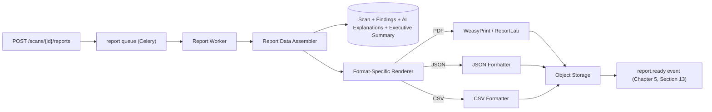
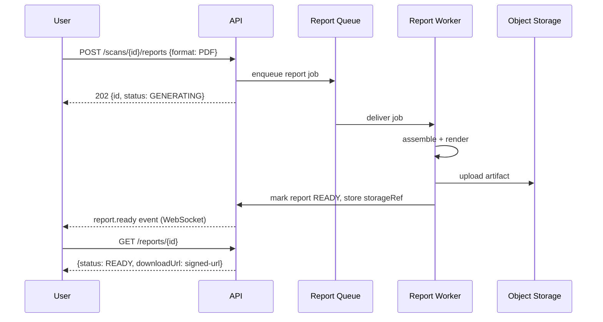

# Software Requirements Specification
## AI-Assisted Vulnerability Assessment Platform

**Chapter 10 — Reporting**
**Version:** 1.0 (Draft) | **Status:** For Review
**Prerequisite:** Chapters 1–9

> Deepens Chapter 4, Section 9 and Chapter 5, Section 10 into how validated findings and AI output (Chapter 9) become the PDF/JSON/CSV deliverables users actually share (Chapter 1, FR-18/FR-19, US-12).

---

## Table of Contents

1. Report Generation Architecture
2. PDF Generation Pipeline
3. Report Template Structure
4. JSON & CSV Export Specifications
5. Async Report Generation Flow
6. Report Storage & Retention
7. Report Regeneration & Versioning
8. Branding & Presentation Standards
9. Accessibility of Generated Reports

---

## 1. Report Generation Architecture

The **Report Data Assembler** is format-agnostic — it pulls one canonical, fully-resolved data structure (scan metadata, engine execution summary, findings with their AI explanations, executive summary) from the database, and each format-specific renderer consumes that same structure. This guarantees the PDF, JSON, and CSV exports of the same scan can never drift into showing inconsistent data, since they share one assembly step.

---

## 2. PDF Generation Pipeline

- **WeasyPrint** (HTML/CSS-to-PDF) is the primary renderer: report content is first composed as a semantic HTML template (Jinja2), styled with a print-oriented CSS stylesheet, then rendered to PDF — chosen over a lower-level library like ReportLab for the initial implementation because it lets report layout be authored and iterated on as HTML/CSS (faster design iteration, easier to keep in sync with the web dashboard's visual language from Chapter 7, Section 6) rather than imperative drawing code.
- **ReportLab** is retained as a documented fallback path for scenarios needing precise low-level layout control (e.g., a future compliance-evidence-pack format, Chapter 1's Future Enhancements) — not used for the standard v1.0 report.
- PDF generation runs in the isolated report worker process (Chapter 6, Section 6), never in the API request path, since rendering a large full-assessment report is CPU/memory-intensive enough to risk blocking other work if run synchronously.
- Generated PDFs embed metadata (scan ID, generation timestamp, report format version) in the PDF's own document properties, so a downloaded file remains self-describing even outside the platform's UI.

---

## 3. Report Template Structure

Mirrors Chapter 1's dual-audience requirement (executive summary vs. technical detail, FR-14) and Chapter 4/9's data model directly:

1. **Cover Section** — target hostname, scan date, scan profile used, overall risk rating (derived from severity distribution).
2. **Executive Summary** — the AI-synthesized narrative (Chapter 9, Section 8), written for a non-technical reader; includes the trend note if a parent scan exists.
3. **Scan Coverage Statement** — which engines ran, their status (including any `PARTIALLY_COMPLETE`/`FAILED` engines, disclosed plainly per Chapter 2, Section 11's "never hide incomplete data" principle) and a plain-language note on what this scan does and does not cover (addressing Chapter 1, R-08 — false-negative risk transparency).
4. **Related Risk Clusters** (only present if the Correlation Engine, Chapter 8 §11, produced any) — each `risk_cluster` rendered as a short block: its title, member findings, and its narrative if one was AI-generated — tagged `AI-generated, validated` or `template-based (rule description)` exactly as Section 5's per-finding tag works, since a cluster narrative carries the same traceability guarantee as a per-finding explanation (Chapter 9, Section 12), never more.
5. **Findings Summary Table** — one row per finding: severity, category, title, lifecycle status (`NEW`/`PERSISTENT`/`RESOLVED`/`REGRESSED` if comparison data exists), sorted by severity descending.
6. **Detailed Findings Section** — one subsection per finding: AI explanation rendered from its `claims` (Chapter 9, Section 4), severity rationale, evidence excerpt, remediation steps — with a visible **"AI-generated, evidence-validated"** or **"template-based fallback"** tag per `ai_explanation.validation_status`. This tag is not cosmetic: it is the report-level surfacing of Chapter 9's core guarantee, and it is never omitted, softened, or merged into a single generic "explanation" label regardless of which path produced the text.
7. **Remediation Priority Appendix** — a consolidated, ordered checklist of all remediation steps across findings, grouped by severity, intended as a standalone actionable artifact a developer/IT admin can work through directly.
8. **Report Metadata Footer** — generation timestamp, platform version, and a fixed disclaimer statement (scope limitations, non-exhaustiveness, authorized-use context) — legally reviewed content per Chapter 1, R-05/R-08.

**Reporting integrity constraint (unchanged, restated for emphasis):** the report renders `severity_level`, `lifecycle_status`, and `finding` identity exactly as the deterministic scanning/correlation pipeline (Chapters 4, 8) established them. No report-generation code path reinterprets, recomputes, or overrides any of these values — the Report Data Assembler (Section 1) is a pure read/render step, never a second source of truth.

---

## 4. JSON & CSV Export Specifications

- **JSON export** mirrors the `GET /scans/{scanId}` + `GET /scans/{scanId}/findings` + `GET /findings/{findingId}` API response shapes (Chapter 5) nested into a single document — chosen deliberately so the export format is not a separate, divergent schema from the live API, easing any future CI/CD integration use case (Chapter 1, Future Enhancements — API access for pipelines).
- **CSV export** is a flattened, one-row-per-finding table (`severity, category, title, affectedAsset, sourceEngine, lifecycleStatus, remediationSummary`) intended for import into spreadsheets or ticket-tracking tools — explanation/remediation *text* is summarized to a single line per field in CSV (full text available via JSON/PDF) since CSV is a poor fit for long-form prose.
- Both formats include the same **scan coverage/disclaimer metadata** as the PDF (Section 3, item 3 and 7) at the top of the document/first row, so a spreadsheet passed along in isolation still carries the platform's scope disclosure.

---

## 5. Async Report Generation Flow

Implements Chapter 5, Section 10's `202 Accepted` pattern concretely:

Report generation for a `PARTIALLY_COMPLETE` or `REPORT_READY_DEGRADED` scan is permitted (not blocked) — the report itself is what communicates the degraded/partial state to the user, per the platform's transparency principle; withholding the report entirely would be worse than delivering an honestly-labeled partial one.

---

## 6. Report Storage & Retention

- Generated report files are stored in object storage (Chapter 2/3) with the database holding only `storage_ref` metadata (Chapter 4, Section 9.1) — never stored as a DB blob.
- **Signed, time-limited download URLs** (Chapter 5, Section 10) — a report is never served as a permanently public static link.
- **Retention policy** (data-privacy-aligned with Chapter 1, NFR-16): report artifacts follow the same retention/deletion rules as their parent scan's data; an account-deletion or data-deletion request cascades to remove associated report files from object storage, not just their database references.
- Reports are **immutable once generated** — regenerating a report (Section 7) creates a new `report` row and a new storage artifact rather than overwriting the prior one, preserving historical report versions for audit purposes (Chapter 4, Section 10).

---

## 7. Report Regeneration & Versioning

- A user can request a fresh report for the same scan after, e.g., a fallback AI explanation is later successfully regenerated (Chapter 5, Section 9; Chapter 9, Section 6) — this produces a new `report` row referencing the same `scan_id`, not a mutation of the old one.
- The platform does **not** support editing report content directly through the API (Chapter 5, Section 9's rule against hand-authored AI content extends to reports as a whole) — a report is always a faithful rendering of underlying scan/finding/AI data, never independently editable text, to preserve the evidence-grounding guarantee all the way to the final artifact users share externally.
- Multiple report versions for the same scan (e.g., one generated the day of the scan, another after AI regeneration a week later) both remain retrievable via `GET /scans/{scanId}/reports` (Chapter 5, Section 10), each individually timestamped.

---

## 8. Branding & Presentation Standards

- v1.0 ships a single, professionally designed report template (no per-user customization) — consistent, predictable output is prioritized over configurability at this stage, deferring white-label/agency branding (Chapter 1, Future Enhancements — white-label/agency mode) to a later phase.
- Visual language (severity color coding, typography) in the PDF matches the `SeverityBadge` component's palette (Chapter 7, Section 6) so a user moving between the dashboard and a downloaded report experiences visual continuity.
- Report language defaults to English in v1.0; the template structure (Section 3) is built with string externalization from the start specifically so multi-language report generation (Chapter 1, Future Enhancements) is a translation-file addition later, not a template rewrite.

---

## 9. Accessibility of Generated Reports

- PDF output includes tagged structure (headings, reading order, alt text for any chart/graphic elements) to remain screen-reader navigable, consistent with the platform-wide accessibility commitment (Chapter 1, NFR-12; Chapter 7, Section 10) rather than treating the PDF as an accessibility-exempt artifact.
- The findings summary table (Section 3, item 4) uses real table markup in the underlying HTML-to-PDF source (not image-rendered tables), preserving text selectability and screen-reader compatibility in the final PDF.

---

*End of Chapter 10. Chapter 11 (Security) consolidates and extends the security controls referenced throughout Chapters 2–10 into a single, comprehensive security architecture and threat model.*
