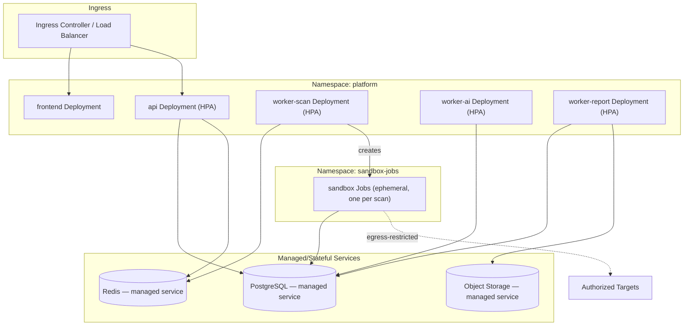

# Software Requirements Specification
## AI-Assisted Vulnerability Assessment Platform

**Chapter 12 — DevOps & Docker**
**Version:** 1.0 (Draft) | **Status:** For Review
**Prerequisite:** Chapters 1–11

> Concrete containerization and deployment design implementing the infrastructure choices from Chapter 3, Section 7 and the sandbox/security requirements from Chapters 8 and 11.
>
> **Read this chapter MVP-first.** Everything in this chapter is real architecture, but not all of it is meant to be built on day one. Sections 1–4 and most of 6–7, 9–10 describe what you actually run for the MVP: Docker Compose, on your own machine for development and on a single free-tier VM for a public demo, $0 either way. Section 5 (Kubernetes) and the autoscaling/service-mesh content in Sections 8–9 are the **future path** — architecturally anticipated so nothing needs a redesign if the project ever needs to scale, but explicitly not required, not blocking, and not something a solo student should feel obligated to stand up. Every "future" section is marked as such below.

---

## Table of Contents

1. MVP Deployment Architecture
2. Dockerfile Design per Service
3. Docker Compose — Local Dev and MVP Production
4. Sandbox Image Design
5. Kubernetes Deployment Architecture *(Future — Production Scale)*
6. Environment & Secrets Strategy in Deployment
7. Image Scanning & Supply Chain Security
8. Autoscaling Configuration *(Future — Production Scale)*
9. Networking & Egress Policy Enforcement
10. Observability Stack

---

## 1. MVP Deployment Architecture

**This is what actually gets built.** One Docker Compose file, one host.

| Service | MVP Deployment | Notes |
|---|---|---|
| `api` | Docker Compose service | Single instance — no horizontal scaling needed at MVP traffic levels |
| `worker-scan`, `worker-ai`, `worker-report` | Docker Compose services, one instance each | Separate Celery queues (Chapter 6, Section 6) still apply — this is about *replica count*, not queue architecture, which is identical to the future path |
| `sandbox` | Provisioned per-scan by `worker-scan` via `DockerSandboxRunner` (Chapter 6, Section 8) — a short-lived `docker run` against a locally-built pinned image, not a Kubernetes Job | Same isolation properties (Section 4) regardless of who provisions it |
| `postgres`, `redis` | Docker Compose services with named volumes | A single Postgres container is genuinely fine at this scale; no managed database needed |
| Object storage | A local Docker volume behind the storage-abstraction interface (Chapter 3, Section 7; Section 6 below) | Swappable for S3-compatible storage later without touching report/scanner code |
| `frontend` | Built static assets served by the same Compose stack (e.g., via Caddy or nginx) | No CDN required at MVP scale |
| TLS / public exposure | **Caddy** (or nginx) as a reverse proxy in front of the stack, with automatic Let's Encrypt certificates — free, and close to zero-config | Only needed if the demo is publicly reachable; local dev skips this entirely |
| Hosting for a public demo | One free-tier VM — **Oracle Cloud Always Free**, **Fly.io**'s free allowance, or **Render**'s free web-service tier all comfortably run this stack | $0. Running on your own machine during development costs nothing either |

**What this deliberately does not have, and doesn't need:** autoscaling, multiple availability zones, a managed database, a service mesh, canary deployments. None of those make a solo-built portfolio platform more correct — they make it more expensive and more operationally demanding to run, for a scale this project isn't at. Section 5 describes what changes if that ever stops being true.

---

## 2. Dockerfile Design per Service

| Image | Contains | Separation Rationale |
|---|---|---|
| `api` | FastAPI app + Uvicorn/Gunicorn | |
| `worker-scan` | Celery worker for the `scan` queue + orchestrator code — does **not** contain Katana/Nuclei/Nikto itself, it dispatches to the sandbox image via `SandboxRunner` (Chapter 6, Section 8) | Keeping the orchestrator distinct from the sandbox means the orchestrator image never needs the sandbox's isolated runtime posture, and the sandbox image never carries the credentials the orchestrator needs (DB, queue) — reinforcing Chapter 8, Section 2 and Chapter 11, Section 5's isolation goals |
| `worker-ai` | Celery worker for the `ai` queue + Gemini client | |
| `worker-report` | Celery worker for the `report` queue + WeasyPrint/ReportLab | |
| `sandbox` | Katana + Nuclei + Nikto + Python native-engine runtime (Chapter 8) | Ephemeral, provisioned per-scan — via `DockerSandboxRunner` for the MVP (Section 1), via a Kubernetes Job for the future path (Section 5) |
| `frontend` | Built static React assets served via a lightweight static server | |

General conventions applied across all application images:
- **Multi-stage builds**: a build stage installs dependencies and compiles/bundles; the final stage copies only the runtime artifacts, keeping images minimal and reducing attack surface.
- **Non-root user**: every container runs as a dedicated non-root user (`appuser`), never `root`, including the sandbox image.
- **Minimal base images**: `python:3.12-slim` (or distroless where feasible) for Python services; the sandbox uses a minimal base with only the required Go binaries and Python runtime added.
- **No secrets baked into layers**: build args never carry secrets; runtime secrets are injected exclusively via the orchestrator's secret-mounting mechanism (Section 6), never `ARG`/`ENV` values fixed at build time.
- **`.dockerignore`** excludes test fixtures, local `.env` files, and version control metadata from build context.

### Example structure (`api` service)
```
FROM python:3.12-slim AS build
WORKDIR /app
COPY pyproject.toml poetry.lock ./
RUN pip install --no-cache-dir poetry && poetry export -f requirements.txt -o requirements.txt
RUN pip install --no-cache-dir -r requirements.txt --target=/deps

FROM python:3.12-slim
RUN useradd -m appuser
COPY --from=build /deps /usr/local/lib/python3.12/site-packages
COPY src/ /app/src/
WORKDIR /app
USER appuser
EXPOSE 8000
CMD ["uvicorn", "src.main:app", "--host", "0.0.0.0", "--port", "8000"]
```

---

## 3. Docker Compose — Local Dev and MVP Production

The same `docker-compose.yml` serves two purposes with minor profile differences, not two separate deployment stories: `docker compose up` locally during development, and `docker compose up -d` on a single free-tier VM for anything meant to be publicly reachable (Section 1).

`docker-compose.yml` provisions the full stack: `api`, `worker-scan`, `worker-ai`, `worker-report`, `postgres`, `redis`, a local volume standing in for object storage, and a `sandbox` image built with the same pinned Katana/Nuclei/Nikto versions used everywhere else (Chapter 8, Section 8) — so local scan-engine behavior matches whatever's running publicly rather than diverging.

- **Local Gemini calls** use a real (rate-limited, free-tier) API key by default, with an optional mocked AI client mode (Chapter 6, Section 4's dependency-override pattern) for offline development and CI, so contributors aren't blocked by quota during routine feature work.
- **Hot-reload** enabled for `api` and `frontend` in the `local` profile; disabled in the `production` profile used for the public-demo deployment.
- **Seed data script** populates a local dev database with sample users, targets (pointing at intentionally-vulnerable local test containers, per Chapter 13), and historical scans — so new contributors can explore the full UI without needing to run a real scan against a real target on day one.
- **The `production` profile adds one thing the `local` profile doesn't need: a reverse proxy.** A `caddy` (or `nginx`) service in front of `api` and `frontend`, terminating TLS via automatic Let's Encrypt certificates and forwarding to the internal Compose network — this is the entire "production hardening" delta between developing this locally and having a real public URL for a demo. No load balancer, no ingress controller, no separate edge tier.
- **Deployment mechanic**: `git pull && docker compose pull && docker compose up -d --build` on the VM. No rolling update, no canary — at MVP scale, a few seconds of downtime during a redeploy is an acceptable, explicitly-accepted tradeoff (Chapter 14, Section 5 states this precisely).

---

## 4. Sandbox Image Design

Directly implements Chapter 8, Section 2 and Chapter 11, Section 5:

- **Pinned tool versions** for Katana, Nuclei, and Nikto, installed via checksummed binary downloads or verified package sources, never `latest`.
- **Pinned, version-tagged Nuclei template set** baked into the image at build time (Chapter 8, Section 8) — templates are not fetched live at scan time from the internet, both for reproducibility and to avoid an uncontrolled runtime dependency on an external template repository's availability/integrity.
- **Read-only root filesystem** with a narrowly scoped writable `tmpfs` mount for tool working directories (Chapter 11, Section 5).
- **No inbound network listener** of any kind — the sandbox only ever initiates outbound connections, and only to the per-scan resolved allow-list.
- **Rebuilt on a scheduled cadence** independent of feature work, to pick up base-image security patches (Chapter 11, Section 5), with each rebuild going through the same image-scanning gate (Section 7) as any other change.

---

## 5. Kubernetes Deployment Architecture *(Future — Production Scale)*

> **Not required for MVP.** Nothing in Chapter 1–11 depends on this section being implemented. It exists so that *if* the platform ever outgrows a single Compose host (Section 1), the path forward is architecturally clear rather than a redesign — the logical components (API, queues, workers, sandbox isolation) are identical either way; only *how they're scheduled* changes.



- **Separate namespace for sandbox jobs** (`sandbox-jobs`) with its own, stricter `NetworkPolicy` — isolating ephemeral scan execution from the long-running application namespace at the Kubernetes network-policy level, an additional layer on top of Chapter 8's container-level egress allow-list.
- **Managed services preferred** for PostgreSQL, Redis, and object storage over self-hosting in early phases, reducing operational burden and inheriting the cloud provider's own patching/security posture for stateful infrastructure.
- **Horizontal Pod Autoscalers (HPA)** on `api`, `worker-scan`, `worker-ai`, `worker-report`, each scaled on a metric appropriate to its load profile — `api` on request rate/CPU, `worker-scan` on queue depth (Chapter 2, Section 14), `worker-ai` on its own queue depth (independently scalable from scan workers per Chapter 6, Section 6).

---

## 6. Environment & Secrets Strategy in Deployment

**MVP:** a single git-ignored `.env` file per environment (`local`, `production`), loaded via Pydantic `BaseSettings` (Chapter 6, Section 5) — never committed, documented in `.gitignore` from the first commit. On the free-tier VM, the `.env` file lives only on that host, readable only by the account running Docker Compose. This is a completely adequate secrets story at this scale — the "Future" bullet below is what it graduates into if the project ever needs multi-environment, multi-person secret rotation at a scale a single file can't reasonably handle.

- Environment tiers (`local`, `production` for the MVP; add `staging` once there's a second environment worth having) map to separate `.env` files with fully isolated credentials — no local credential is ever valid against the production VM, even though both are "just a file" mechanically.
- **Secret rotation (MVP)**: update the `.env` file on the VM, `docker compose up -d` to restart affected services — a manual but entirely sufficient runbook (Chapter 3, Section 17) at this scale.
- **Future — Production Scale**: secrets migrate to a cloud provider's native secrets manager (Chapter 3, Section 7; Chapter 11, Section 4) integrated with Kubernetes' secret-injection mechanism (Section 5), with automated rotation triggering a rolling restart. The `BaseSettings`-based loading pattern in application code doesn't change either way — only where the values come from.

---

## 7. Image Scanning & Supply Chain Security

**Applies at MVP scale too — this is free tooling, not an enterprise-only cost.** Every image build (application and sandbox) is scanned in CI (Chapter 14) using a free scanner (e.g., `trivy`) for known vulnerabilities before being deployed; a critical/high finding blocks the deploy per NFR-05, regardless of whether that deploy target is a Kubernetes cluster or a single VM.

- **SBOM generation** per image build (Chapter 11, Section 10) — `trivy` and similar free tools produce this natively; stored alongside the image artifact for audit and rapid impact-assessment when a new CVE is disclosed against a base image or dependency.
- **Future — Production Scale**: image *signing* at build time with signature verification via an admission-controller policy (only CI-produced artifacts can run) is a Kubernetes-era control (Section 5) — meaningful once there's a cluster admission path to enforce it against. At MVP scale, the equivalent control is simpler: only the CI pipeline has deploy credentials to the VM at all (Chapter 14, Section 7), so a manually-pushed image is already excluded by not having anywhere to push it to.
- Registry retention policy keeps a bounded history of prior image versions to support fast rollback (Chapter 14) without unbounded storage growth — applies identically at either scale.

---

## 8. Autoscaling Configuration *(Future — Production Scale)*

> **MVP has none of this, deliberately.** One instance of each service (Section 1) handles realistic student/demo traffic without breaking a sweat; adding autoscaling now would be solving a problem that doesn't exist yet at real cost in operational complexity. This section is what to reach for if that ever changes.

| Component | Scale Trigger | Min/Max (illustrative — tuned per launch traffic) |
|---|---|---|
| `api` | CPU utilization / request rate | 2 / 10 |
| `worker-scan` | Celery `scan` queue depth | 2 / 20 |
| `worker-ai` | Celery `ai` queue depth (also bounded by Gemini rate-limit ceiling to avoid over-scaling into throttling) | 1 / 8 |
| `worker-report` | Celery `report` queue depth | 1 / 6 |
| `sandbox` Jobs | One per active scan, naturally bounded by `worker-scan`'s own concurrency ceiling (Chapter 8, Section 7) rather than a separate autoscaler | — |

Queue-depth-based scaling (rather than pure CPU) is deliberately used for the worker tiers, since scan/AI/report jobs are often I/O-bound (waiting on target responses or the Gemini API) in ways that don't show up as high CPU usage but do show up as queue backlog — matching Chapter 2, Section 14's original scalability rationale. **Note for whoever eventually builds this:** vanilla Kubernetes HPA only reads CPU/memory natively — it has no built-in concept of Celery/Redis queue depth. Queue-depth-based autoscaling requires **KEDA** (or a custom metrics adapter feeding queue depth into HPA's custom-metrics API) — plan for KEDA specifically when this section is actually implemented, not a bare HPA config.

---

## 9. Networking & Egress Policy Enforcement

**MVP:** Docker Compose's default per-project network already isolates this stack from the host and other projects. Within it, the `sandbox` service is placed on a **separate Compose network** from `api`/`worker-*`/`postgres`/`redis`, with no network alias connecting them — the sandbox container has no route to the data-layer network at the Docker networking level, not just by convention (Chapter 2, Section 13's stated invariant, enforced here at the infrastructure layer even without Kubernetes). Egress from the sandbox to the actual scan target is what it always was regardless of orchestrator: resolved and allow-listed per scan (Chapter 8, Section 2).

- **`api`, `worker-*` (non-sandbox) services** have no route to the internet at all beyond their required dependencies (database, Redis, the local storage volume, the Gemini API endpoint) — reinforcing Chapter 2, Section 1's "only the sandbox reaches external targets" rule at the Compose network layer.
- **Ingress** is TLS-terminated at the Caddy/nginx reverse proxy (Section 3); internal container-to-container traffic stays on the private Compose network, which isn't reachable from outside the host at all.

**Future — Production Scale**: the same isolation goal, enforced by Kubernetes `NetworkPolicy` instead of Compose network segmentation — default-deny egress at the namespace level for `sandbox-jobs`, with narrow per-Job allow rules matching the specific target being scanned (Section 5). mTLS between internal services is a further defense-in-depth layer available once a service mesh is in play, not needed at MVP scale where all traffic stays on a single trusted host's private network.

---

## 10. Observability Stack

**MVP:** structured logs (`structlog`, Chapter 2 Section 12; Chapter 6 Section 9) write to stdout, readable via `docker compose logs -f <service>` — no log aggregator needed at single-host scale. The operational/audit log separation still applies exactly as designed: audit events go to the append-only Postgres table (Chapter 4, Section 10), everything else to stdout. Optionally, a free-tier error tracker (e.g., Sentry's free plan) catches unhandled exceptions with a stack trace and alert, which is a meaningfully better experience than only `docker compose logs` for anything that actually breaks — genuinely worth the zero-cost setup.

**Future — Production Scale:**
- **Metrics**: Prometheus-compatible exporters on `api` and each worker tier (request latency, queue depth, scan duration percentiles, Gemini call latency/error rate, sandbox provisioning success rate) feeding Grafana-style dashboards.
- **Alerting** on: elevated error rates, queue-depth thresholds sustained beyond a window (Chapter 2, Section 14), sandbox provisioning failure rate spikes, and any egress-policy-block event (Chapter 11, Section 11's detection phase).
- **Distributed tracing** (request ID propagation, Chapter 6, Section 9) across API → queue → worker → AI/sandbox call boundaries — most valuable once there are enough service instances that "which one handled this request" isn't obvious just from reading a single-host log stream.

---

*End of Chapter 12. Chapter 13 (Testing) defines how all of the above — application code, scanner integrations, AI validation, and infrastructure — is verified before it ships.*
