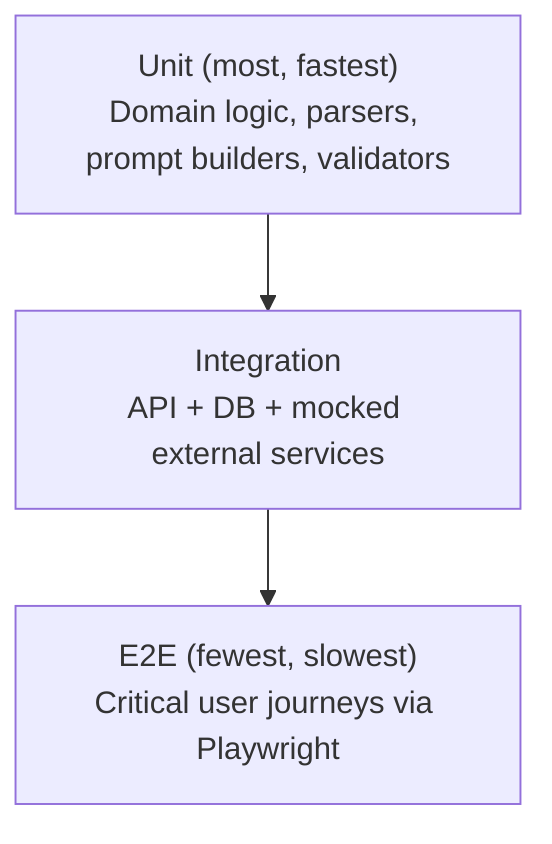

# Software Requirements Specification
## AI-Assisted Vulnerability Assessment Platform

### Evaluation-test boundary
Testing must distinguish software correctness tests from research evaluation. Property-based tests are focused on target normalization/SSRF validation, fingerprint generation, and scanner-output parsers. Research evaluation separately measures correlation, prioritization, efficiency, grounding, and reproducibility.

**Chapter 13 — Testing**
**Version:** 2.0 (Revised Draft) | **Status:** For Review
**Prerequisite:** Chapters 1–12

> Expands Chapter 3, Section 15's testing standards into a full test strategy, with particular depth on the two hardest-to-test subsystems in this platform: scanner engines (which touch real network targets) and AI output (which is inherently non-deterministic).

---

## Table of Contents

1. Test Strategy & Pyramid
2. Unit Testing Approach
3. Integration Testing Approach
4. Scanner Engine Testing
5. AI Validation Testing
6. Security Testing
7. Load & Performance Testing
8. End-to-End Testing
9. Test Data Management
10. User Acceptance Testing & Exit Criteria

---

## 1. Test Strategy & Pyramid

The pyramid shape is enforced by CI coverage gates (Chapter 3, Section 15) and code-review convention: a new domain rule (e.g., a new finding-lifecycle transition rule) should arrive with a unit test, not primarily an E2E test, which is reserved for verifying the pieces actually connect correctly end-to-end.

---

## 2. Unit Testing Approach

Per Chapter 3, Section 15, `pytest` covers:
- **Domain logic**: scan-state machine transitions (valid/invalid), finding-lifecycle-status computation (`NEW`/`PERSISTENT`/`RESOLVED`/`REGRESSED` — Chapter 4, Section 6.2), attestation validity rules (Chapter 4, Section 8).
- **Normalization parsers**: each engine's `normalize_output()` (Chapter 8, Section 5) tested against recorded, real (but anonymized where needed) sample raw tool output — not live tool invocations.
- **Fingerprint generation**: the algorithm in Chapter 8, Section 6, tested for stability against known input variations (case differences, volatile query params) to catch any change that would silently break cross-scan finding tracking.
- **Prompt builders**: tested for correct *structure* of the assembled prompt/context object (Chapter 9, Sections 2–3) — never against a live Gemini call, which belongs in integration/validation testing (Section 5).
- **Property-based testing (Hypothesis), scoped deliberately narrow:** applied to exactly three surfaces, not the codebase broadly — target normalization/SSRF validation (Section 6), fingerprint generation, and scanner-output parsers (`normalize_output()`). These are the places hand-written examples are least likely to catch the cases that matter (unicode homograph domains, IP-in-hex encodings, malformed/truncated nested JSON from a scanner tool) — and the places where a missed edge case has the highest cost (Chapter 11, Section 2 ranks SSRF as the platform's single most relevant OWASP risk). Property testing is explicitly **not** required project-wide; for a solo-built MVP, applying it everywhere would cost real time for very little marginal safety on low-risk code.
- Because Domain logic is decoupled from persistence and framework concerns (Chapter 6, Section 7), the large majority of unit tests run without a database or network connection, keeping the suite fast enough to run on every save during development.

---

## 3. Integration Testing Approach

- **API-level integration tests** exercise real FastAPI routes against a real (ephemeral, containerized via `testcontainers`) PostgreSQL instance, verifying the full request → domain → repository → DB round trip, including Alembic migration application from a clean schema (Chapter 3, Section 15).
- **Negative-path coverage is mandatory**, not optional, for the platform's trust-critical flows (Chapter 3, Section 15's non-negotiable gate): scan creation without a confirmed attestation, scan creation against an SSRF-blocked target, cross-org resource access attempts, expired/revoked attestation usage.
- **Celery task integration tests** run against a real (test-scoped) Redis broker with tasks executed eagerly/synchronously in the test process, verifying task chaining (scan → AI → executive summary, Chapter 6, Section 6) behaves correctly, including partial-failure paths.
- **External services are mocked at the boundary**, not the internal logic: the Gemini client and the sandbox-provisioning call are mocked/stubbed for standard integration tests, so this suite is fast, deterministic, and runnable without external API quota — live-service integration is covered separately (Sections 4–5).

---

## 4. Scanner Engine Testing

The platform's own scanning engines are tested exclusively against **controlled, intentionally-vulnerable local test targets** — never against live third-party sites, even well-known "safe to scan" ones — both to keep tests deterministic (a real website's content/headers change over time) and to strictly uphold the authorized-use principle within the platform's own test infrastructure (Chapter 1's ethical stance applies to how the Platform tests itself, not only to end users).

| Test Target | Purpose |
|---|---|
| Local deliberately-vulnerable web app container (e.g., an OWASP-style intentionally vulnerable app run in CI) | Validates Nuclei/Nikto find expected known issues; validates Katana crawl-depth and asset discovery behavior |
| Local containers with known header/TLS misconfigurations | Validates `headers-analyzer` and `ssl-inspector` against specific, reproducible configurations (missing HSTS, expired cert, weak cipher) |
| Local mock DNS/WHOIS responders | Validates `dns-lookup`/`whois-lookup` parsing against both well-formed and edge-case (privacy-redacted WHOIS, missing records) responses |

- **Golden-file assertions**: each engine's expected normalized `Finding` output for a given controlled target is checked into the test suite as a golden file; a test failure signals either a real regression or an intentional-and-reviewed change to normalization logic (in which case the golden file is updated as part of that same PR, not silently).
- **Timeout/failure-path tests**: a deliberately unresponsive local target validates that engine timeouts (Chapter 8, Section 7) correctly produce a `TIMED_OUT` `scan_engine_execution` without stalling the rest of the scan.
- **Tool-version upgrade tests**: whenever Katana/Nuclei/Nikto is version-bumped (Chapter 8, Section 8), the full golden-file suite is re-run before the version pin is merged, catching any output-format drift immediately rather than in production.
- **SSRF/target-validation tests**: explicit test cases asserting that private-IP, localhost, and cloud-metadata-address targets are rejected before any engine is ever dispatched (Chapter 11, Section 6) — this suite runs on every PR, not just periodically, given its criticality.

---

## 5. AI Validation Testing

Directly tests the guarantees claimed in Chapter 9:

- **Schema validation tests**: well-formed and deliberately malformed mock Gemini responses fed through the response validator (Chapter 9, Section 5) to confirm both the happy path and every failure stage correctly triggers the fallback (Chapter 9, Section 6) rather than silently passing bad data through.
- **Evidence cross-reference tests**: a mock response introducing a claim/CVE not present in the supplied context must be caught by stage 3 of the validator (Chapter 9, Section 5) — this is a required, explicitly-named test case per finding category, not a general "AI works" smoke test.
- **Fallback-template review tests**: every fallback template (Chapter 9, Section 6) has an associated test asserting it renders correctly and contains no placeholder/lorem-ipsum artifacts — since fallback content ships directly to users, it is held to the same correctness bar as any user-facing string.
- **Prompt-regression suite**: a fixed set of representative findings (covering each `finding_category`) is run through the real Gemini API (not mocked) on a scheduled cadence and before any prompt-template version change ships (Chapter 9, Section 9) — output is reviewed for quality drift, not just schema validity, since a response can be technically valid but qualitatively worse than before.
- **Traceability assertion**: an automated check that every `ai_explanation` produced in test runs answers the "three questions" from Chapter 9, Section 11 (which finding, what evidence, validated-or-fallback) — codifying that acceptance criterion as an executable test, not just a manual review checklist.

---

## 6. Security Testing

| Type | Scope | Cadence |
|---|---|---|
| SAST | Python codebase (`bandit`), including the `shell=True` ban (Chapter 11, Section 2) | Every PR (CI gate) |
| Dependency scanning | `pip-audit`, container/SBOM scanning (Chapter 12, Section 7) | Every PR + scheduled |
| DAST | Automated scan of the platform's own staging deployment (using the platform's own scanning capability against itself, in a fully authorized, self-attested internal-use context — a deliberate dogfooding exercise) | Per release candidate |
| Manual/external penetration testing | Focused on sandbox isolation boundary, attestation-enforcement path, and auth/session handling (Chapter 11, Section 3) | Pre-major-release, and periodically thereafter |
| SSRF-specific test suite | Section 4 above, plus targeted fuzzing of the target-normalization function with malformed/edge-case URLs (IP-in-hex, IPv6 loopback variants, DNS-rebinding simulation) | Every PR touching target validation logic; scheduled full run otherwise |

---

## 7. Load & Performance Testing

- **API load testing**: simulated concurrent user traffic against dashboard/history/scan-listing endpoints, validating NFR-09's uptime/responsiveness targets under load and confirming cache-layer effectiveness (Chapter 6, Section 5's Redis usage) reduces DB pressure as expected.
- **Scan-throughput load testing**: simulated concurrent scan submissions validating queue backpressure behavior (Chapter 2, Section 14) — confirming the system degrades honestly (accepts requests, communicates realistic wait times) rather than silently timing out or crashing under burst load.
- **Scan-duration benchmarking**: validates the concrete time targets from Chapter 2, Section 5.3 (`quick-check` < 60s, `full-assessment` < 15 min) against representative test targets of varying size/complexity, run on a schedule to catch performance regressions introduced by engine-version or infrastructure changes.
- **AI-layer load testing**: validates the concurrency-bounding design (Chapter 9, Section 7) correctly throttles Gemini call volume to stay within provider rate limits even during a burst of large full-assessment scans completing simultaneously.

---

## 8. End-to-End Testing

Playwright (or Cypress) covers the platform's critical user journeys end-to-end against a full staging-like environment (real DB, real queue, mocked Gemini for determinism, real sandbox against controlled test targets):

1. Register → login (including MFA) → land on dashboard.
2. Register a target → submit attestation → attempt scan before confirmation (expect block) → confirm attestation → scan succeeds.
3. Full-assessment scan → observe real-time progress events → view findings with AI explanations → generate and download a PDF report.
4. Re-scan the same target → view scan comparison (new/persistent/resolved/regressed).
5. Attempt to scan a private-IP/localhost target → confirm rejection with the correct error code (Chapter 5, Section 14).
6. Org admin invites a member, member has restricted access verified (cannot access admin-only audit log).

E2E suite runs are intentionally kept to these critical journeys (not exhaustive feature coverage) to keep the suite maintainable and fast, per the pyramid principle in Section 1.

---

## 9. Test Data Management

- **Synthetic data only** for automated test suites — no real user data, real scan targets, or real customer information is ever used in test environments, consistent with the data-protection posture in Chapter 11, Section 7.
- **Seed/fixture library**: reusable factory functions (`create_test_user()`, `create_test_target()`, `create_test_scan_with_findings()`) shared across unit/integration/E2E suites, reducing duplication and keeping test-data shape in sync with the Chapter 4 schema as it evolves.
- **Golden files** (Section 4) and **prompt-regression fixtures** (Section 5) are version-controlled alongside the code they validate, reviewed in PRs like any other test asset.
- **Test-environment data resets** between CI runs (ephemeral containerized DB per run via `testcontainers`) to guarantee no cross-run state leakage or flaky ordering dependencies.

---

## 10. User Acceptance Testing & Exit Criteria

Maps back to Chapter 1's Success Metrics and personas:
- **Persona-based UAT scripts**: representative tasks run by non-engineering reviewers standing in for Maria (small-business owner) and Daniel (student) personas (Chapter 1, Section 8), specifically validating the **comprehension** success metric (≥85% understand the executive summary unaided) — this is a qualitative test that automated suites cannot cover.
- **Release exit criteria** (all required before a release candidate is promoted to production):
  - All CI gates green (lint, type-check, unit, integration, SAST, dependency scan, image scan).
  - Scanner engine golden-file suite passing against current pinned tool/template versions.
  - AI validation suite (Section 5) passing, including the prompt-regression review sign-off.
  - No open critical/high security findings from the pre-release DAST/pen-test pass (Section 6).
  - UAT persona scripts completed with no blocking usability findings.
  - Load-test benchmarks (Section 7) within the targets defined in Chapter 1's NFRs.

---

*End of Chapter 13. Chapter 14 (CI/CD) defines the pipeline that automates and enforces every gate described in this chapter.*