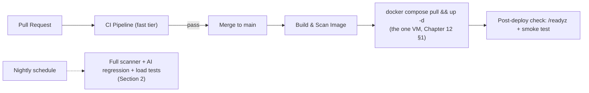
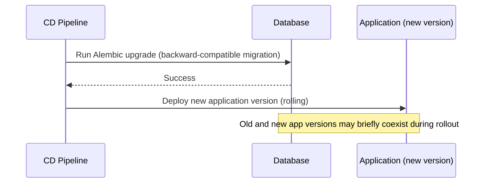

# Software Requirements Specification
## AI-Assisted Vulnerability Assessment Platform

**Chapter 14 — CI/CD**
**Version:** 1.0 (Draft) | **Status:** For Review
**Prerequisite:** Chapters 1–13

> Defines the automated pipeline that enforces every quality and security gate described in Chapters 3, 11, 12, and 13, and governs how code moves from a merged PR to running in production.
>
> **MVP note:** this chapter describes the full pipeline shape, but at MVP scale (Chapter 12, Section 1 — Docker Compose, one host) "deploy to production" means `docker compose pull && up -d` on that one VM, not a multi-environment promotion through a Kubernetes cluster. Sections 3 and 5 spell out exactly what simplifies and what doesn't; nothing here requires the future-scale infrastructure from Chapter 12, Section 5 to be true today.

---

## Table of Contents

1. Pipeline Overview
2. Continuous Integration Stages
3. Continuous Deployment Stages & Environments
4. Branching & Release Strategy
5. Deployment Strategy
6. Rollback Procedures
7. Secrets in CI/CD
8. Database Migration Deployment Process
9. Release Versioning & Changelog

---

## 1. Pipeline Overview

CI (fast, per-PR feedback) and CD (deliberate, gated promotion to the live environment) are treated as distinct pipelines with different risk tolerances — CI optimizes for speed and developer feedback loop; CD optimizes for safety and reversibility. At MVP scale, "deliberate and gated" means a human runs the deploy command after CI is green, not an automated multi-stage promotion — that's still deliberate, just proportionate to running one server.

---

## 2. Continuous Integration Stages

Split into two tiers by cadence — this is the single most important thing this chapter changes from a naive "run everything on every PR" setup, and it matters for a solo developer's day-to-day experience as much as for correctness.

**Fast tier — every pull request, using GitHub Actions (Chapter 3, Section 7):**

| Stage | Tooling | Gate |
|---|---|---|
| Lint & format check | `ruff`, `black --check` (backend); `eslint`, `prettier --check` (frontend) | Required |
| Type check | `mypy --strict` (backend); `tsc --noEmit` (frontend) | Required |
| Unit tests | `pytest` (backend); Vitest/Jest (frontend) | Required, coverage threshold enforced (Chapter 3, Section 15) |
| Targeted integration tests | `pytest` against `testcontainers` PostgreSQL/Redis — fast, no live scanner tools or live Gemini calls | Required |
| AI validation suite (mocked) | `pytest` with mocked Gemini responses, checking schema/validator logic only — no live API call, no rate limit exposure (Chapter 13, Section 5) | Required for changes touching `ai/` |
| SAST | `bandit` (backend) | Required |
| Dependency scan | `pip-audit`, `npm audit` (or equivalent) | Required, blocks on critical/high |
| Import-boundary lint | Custom check enforcing Chapter 6, Section 11's module dependency rules | Required |
| Accessibility lint | `eslint-plugin-jsx-a11y` | Required for frontend changes |
| Migration check | Alembic upgrade/downgrade dry-run against a clean test DB (Chapter 4, Section 14) | Required for changes touching models/migrations |
| Generated-types freshness | Fails if frontend TypeScript types are stale against the current OpenAPI schema (Chapter 7, Section 7) | Required for changes touching API schemas |

**Nightly / pre-release tier — expensive suites that don't belong in the PR feedback loop:**

| Stage | Tooling | Cadence |
|---|---|---|
| Scanner engine golden-file suite | `pytest` against local controlled test targets, running real Katana/Nuclei/Nikto (Chapter 13, Section 4) | Nightly, and required before any release tag |
| AI prompt-regression suite | Real (not mocked) Gemini calls against a fixed finding set (Chapter 9, Section 9; Chapter 13, Section 5) | Nightly, and required before any release tag |
| Load/performance tests | Chapter 13, Section 7 | Pre-release only |
| Extended E2E suite | Full critical-journey coverage (Chapter 13, Section 8) | Nightly |

Chapter 13's testing *content* is unchanged by this split — every suite described there still exists and still runs; this section only changes *when*. A PR that only touches, say, the reporting template doesn't wait on a live Nuclei scan to get feedback; a release tag never ships without one having passed recently.

**Merge requirements** (Chapter 3, Section 16): all fast-tier stages green, plus 1 reviewer approval (2 for `scanning/`, `ai/responseValidators/`, `infrastructure/secrets/`, `authorizationAttestationGuard`). The nightly-tier suites are a release gate, not a merge gate — a PR can merge to `main` without waiting on them, but `main` can't be tagged for release if the most recent nightly run failed.

---

## 3. Continuous Deployment Stages & Environments

**MVP:** two environments, not three — `local` (each contributor's own machine) and `production` (the one free-tier VM, Chapter 12, Section 1). There's no separate `staging` host at this scale; a merged PR that passes the fast CI tier deploys straight to production via the manual step in Section 5, and the controlled-test-target discipline below still applies — it's just enforced by policy on the one environment that exists, rather than by a dedicated staging tier.

- The image built in CI is the **exact same image** that runs in production (build-once principle) — never a separately-built "prod version" — eliminating "works locally, breaks in prod due to a different build" failure classes.
- Public-demo scan targets are restricted to the controlled test-target set from Chapter 13, Section 4 by policy — the live deployment is never used to scan real, arbitrary third-party sites as a way of "testing in production," keeping the platform's own authorized-use principle intact even during development.

**Future — Production Scale:** once there's a reason to have more than one deployed environment (a second contributor, a paying customer, a compliance requirement), reintroduce `staging` as a separate host mirroring production topology, with automatic promotion from `main` and a full E2E/load-test gate before manual production promotion — the classic three-tier flow. Nothing about the MVP's application code or CI stages needs to change to add this; only the CD *pipeline* gains a stage.

---

## 4. Branching & Release Strategy

Recapping and operationalizing Chapter 3, Section 16:
- Trunk-based development; short-lived feature branches merged via PR into `main`.
- `main` is always deployable — a merge that breaks production triggers an immediate investigation, not a backlog item, since it indicates a CI gap (something CI should have caught but didn't).
- **Release cuts** are tagged commits on `main` (`vX.Y.Z`, semantic versioning) — production deploys are always from a tagged release, never an arbitrary `main` commit, to keep the "what's actually running in prod" question always answerable even without a formal approval-gate ceremony.
- **Hotfixes**: a critical production issue may be patched via an expedited branch off the last production tag, going through the same fast-tier CI gates (no skipped stages, even under time pressure) but deployed immediately once green, without waiting for the nightly tier.

---

## 5. Deployment Strategy

**MVP:** `docker compose pull && docker compose up -d --build` on the single VM (Chapter 12, Section 3), run manually by the developer once CI is green on a tagged release — or via a simple GitHub Actions deploy job that SSHes in and runs the same command. Compose's default `up -d` behavior recreates changed containers with a brief gap (seconds, not minutes) while the new container starts and passes its health check; **this brief downtime during a redeploy is an explicitly accepted tradeoff at MVP scale**, not an oversight — it costs nothing in practice for a portfolio project's realistic traffic pattern, and avoiding it entirely is exactly the kind of complexity Chapter 12, Section 1 deliberately defers.
- **Database migrations deploy separately from application code** (Section 8) — the migration step always completes and is verified before the new application container starts, regardless of whether that's a single `docker compose run api alembic upgrade head` command or a Kubernetes job.
- **Frontend and backend deploy together** at MVP scale (same `docker compose up -d`) — the API versioning discipline (Chapter 5, Section 17) is what would make decoupling them safe later, but there's no operational reason to bother decoupling them while both live on the same host.

**Future — Production Scale:** rolling deployment across multiple `api`/worker replicas, with **progressive/canary rollout** specifically for changes touching the scan orchestrator, AI response validator, or attestation guard — a small percentage of traffic routed to the new version first, monitored against error-rate/latency baselines (Chapter 12, Section 10) before full rollout. This requires the Kubernetes path (Chapter 12, Section 5) to have somewhere to route partial traffic to; it isn't meaningfully approximable on a single Compose host, which is exactly why it's listed here as a future capability rather than something to fake at small scale.

---

## 6. Rollback Procedures

**MVP:** redeploy the previous image tag — `docker compose up -d` with the prior tagged version referenced in `docker-compose.yml` (or an environment variable pinning the tag), reversing the change in well under a minute. This is fast and reliable specifically *because* the MVP has no multi-stage rollout to unwind — there's one container per service, and "roll back" means "start the old one instead of the new one."
- **Migration rollback**: only attempted when the migration's tested downgrade path (Chapter 3, Section 11; Chapter 4, Section 14) exists and is safe; for migrations deemed non-reversible in practice (e.g., a destructive data transformation), the standing policy is **forward-fix, not downgrade** — a new migration correcting the issue, rather than attempting a risky downgrade against live data. This policy is identical regardless of deployment scale.
- **Rollback drills**: periodically practice the rollback command against the actual production VM during a low-traffic window (not just a hypothetical), so it's a known, rehearsed action rather than something improvised for the first time during a real incident.

**Future — Production Scale:** automatic rollback triggers tied to the canary/progressive rollout (Section 5) — the deployment automatically halts and reverts if error-rate or latency thresholds are breached during the monitored rollout window, without requiring a human to notice first. This capability is downstream of the canary infrastructure itself; it doesn't exist independently of it.

---

## 7. Secrets in CI/CD

- CI pipeline secrets (registry credentials, the production VM's SSH/deploy credential) are stored in the CI platform's native encrypted secrets store, scoped to the minimum required jobs — e.g., the PR-validation workflow (Section 2's fast tier) has no deploy credentials at all, since it never needs to deploy anything.
- **No production secrets are ever accessible to PR-triggered CI runs** (which can run code from external/fork contributions in an open contribution model) — production secrets are scoped exclusively to the post-merge deployment job (Section 3).
- Secret values are never printed to CI logs; the pipeline configuration is reviewed to ensure no debug/verbose step could inadvertently echo an injected secret (a documented CI-configuration review checklist item).

---

## 8. Database Migration Deployment Process

- **Expand/contract pattern**: schema changes that could break the currently-running (old) application version during a rolling deploy are split into two releases — first an additive/backward-compatible migration (e.g., add a new nullable column), deployed and allowed to bake, then a later release that removes/tightens the old structure once all application instances are confirmed on the new version. This directly follows from Chapter 4's lookup-table/extensibility design philosophy — most anticipated schema growth (Chapter 4, Section 14) fits the "additive" half of this pattern naturally.
- Migrations are applied by the CD pipeline itself (a dedicated migration job/step), never by the application on startup implicitly — keeping migration execution a visible, logged, individually-reviewable pipeline step.

---

## 9. Release Versioning & Changelog

- **Semantic versioning** (`MAJOR.MINOR.PATCH`) for the platform release as a whole; the API's own versioning (Chapter 5, Section 17, `/api/v1/`, `/api/v2/`) is independent and only bumps on an actual breaking API contract change, which is rarer than general platform releases.
- **Automated changelog generation** from Conventional Commits (Chapter 3, Section 16) grouped by type (`feat`, `fix`, `security`, `chore`) per release tag, published internally and, for user-relevant entries, summarized into public release notes.
- **Security-tagged commits** (`security:` prefix) are surfaced distinctly in the internal changelog view, supporting the compliance/audit-readiness goal from Chapter 11, Section 12 — a reviewer can quickly see what security-relevant changes shipped in a given release without reading every commit.

---

*End of Chapter 14. Chapter 15 (Implementation Guide) ties Chapters 1–14 together into a phased build roadmap.*
