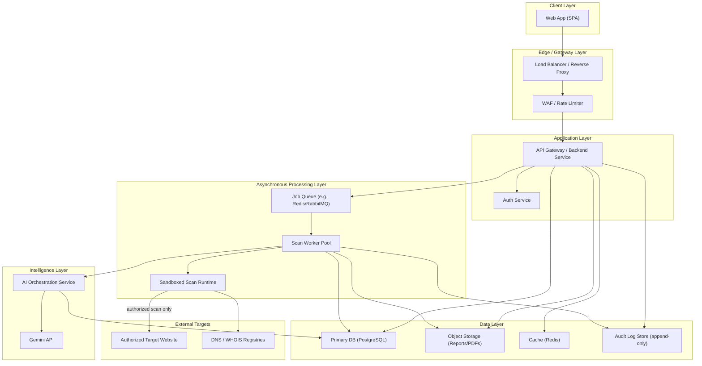
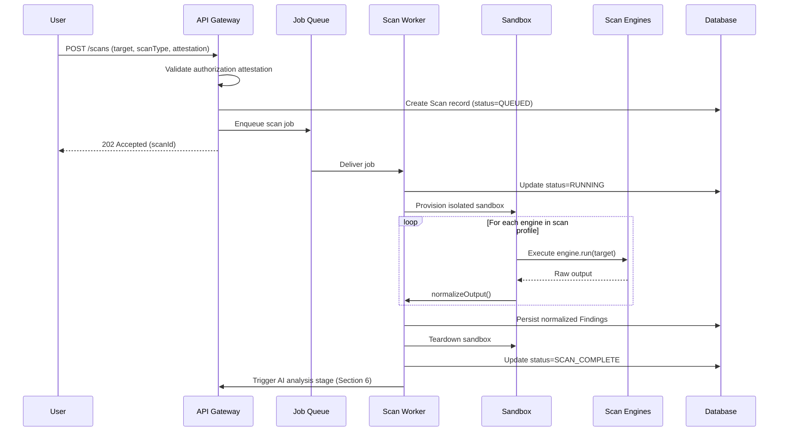
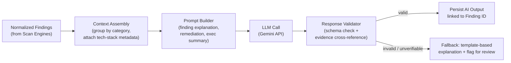
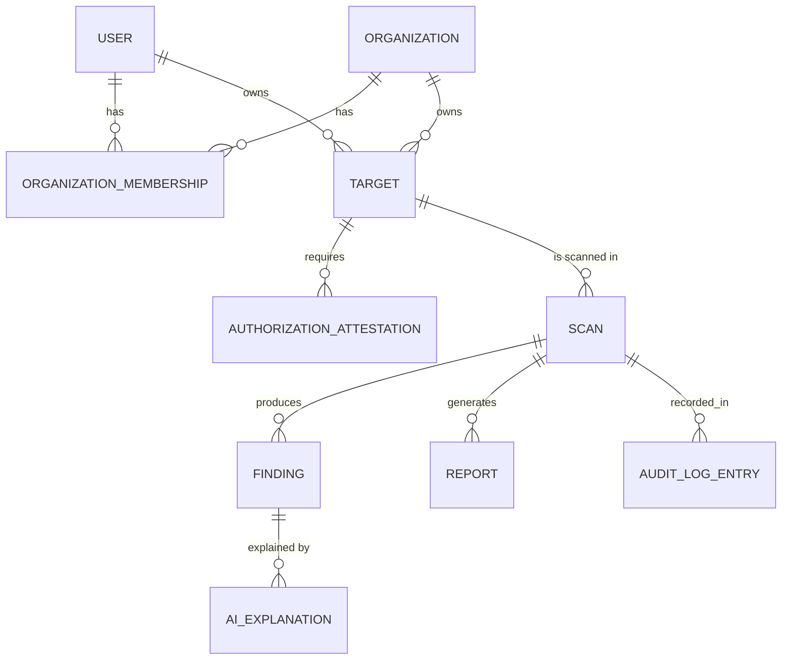
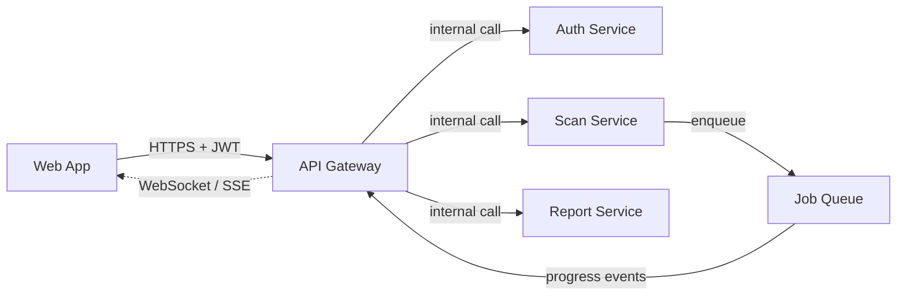
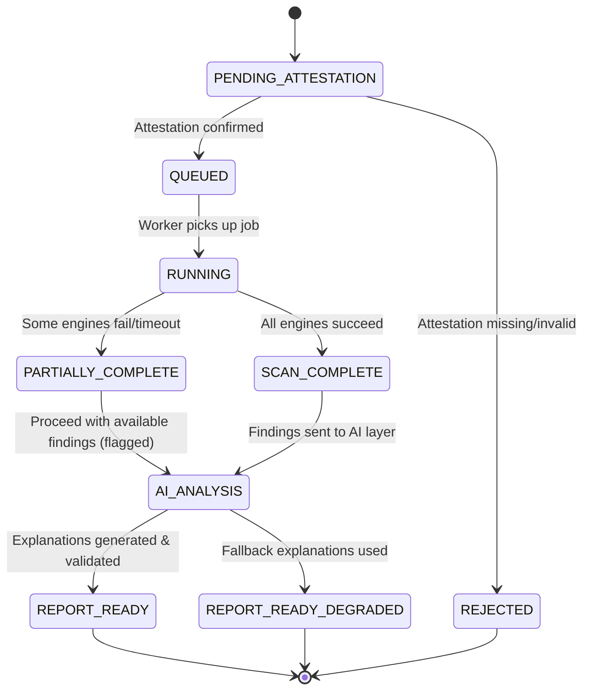
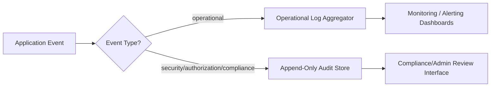
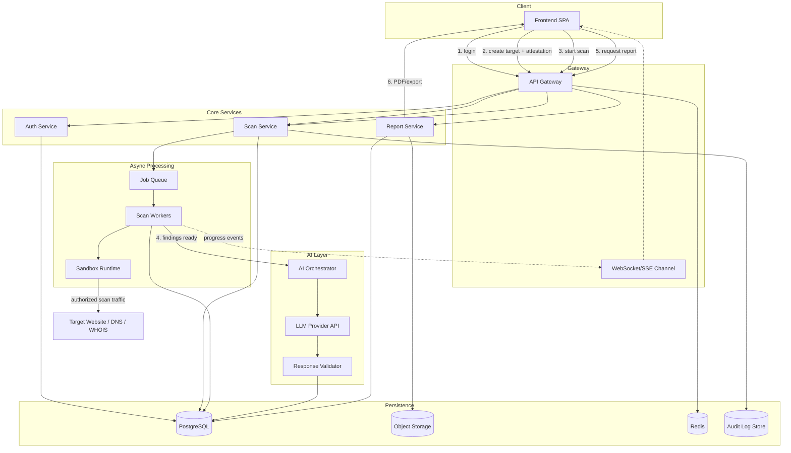

# Software Requirements Specification

### Research-alignment invariant

The architecture treats SentinelGPT as a **vulnerability-intelligence and analysis pipeline**, not an autonomous penetration-testing agent. The canonical flow is:

`authorized scan → raw evidence → normalized observations → candidate findings → deterministic correlation/deduplication → contextual enrichment → evidence-grounded AI interpretation → deterministic validation → human verification → prioritized reporting`

Scanners remain the source of detection evidence. The normalization layer first creates lossless **observations** from tool output; only subsequent deterministic logic promotes observations into canonical findings and relationships. The AI layer interprets supplied evidence and must not originate findings, silently merge findings, assign canonical severity, or initiate exploitation. This separation is required for reproducibility and for the research evaluation described in Chapter 1.
## AI-Assisted Vulnerability Assessment Platform

**Document Type:** Software Requirements Specification (SRS)
**Chapter:** 2 — System Architecture
**Version:** 2.0 (Revised Draft)
**Status:** For Review
**Prerequisite:** Chapter 1 — Foundations & Requirements Overview

---

## Table of Contents

1. High-Level Architecture Diagram
2. Component Architecture
3. Backend Folder Structure
4. Frontend Folder Structure
5. Scanner Engine Architecture
6. AI Analysis Architecture
7. Database Interaction Flow
8. API Communication Flow
9. Authentication Flow
10. Scan Lifecycle
11. Error Handling Strategy
12. Logging Architecture
13. Security Architecture
14. Scalability Considerations
15. Technology Interaction Diagram

---

## 1. High-Level Architecture Diagram

The Platform follows a **layered, service-oriented architecture** with a clear separation between the request-serving layer (API), the asynchronous processing layer (scan workers), and the intelligence layer (AI explanation service). This separation exists specifically because scanning is long-running and unpredictable in duration, while the API and dashboard must remain fast and responsive at all times.



**Key architectural principle:** the **Sandboxed Scan Runtime** is the only component permitted to make outbound network calls to external targets. No other service — API, AI orchestration, or frontend — has direct network reachability to a scan target. This containment is deliberate: it bounds the blast radius if a scan module is ever compromised or misbehaves, and it creates a single, auditable choke point for all outbound scanning traffic (Section 13).

---

## 2. Component Architecture

| Component | Responsibility | Notes |
|---|---|---|
| **Web App (SPA)** | User-facing interface: auth screens, scan initiation, dashboard, reports. | Framework-agnostic at this stage (React/Vue candidate); communicates only via the API Gateway. |
| **Load Balancer / WAF** | Distributes traffic, terminates TLS, applies rate limiting and basic request filtering. | First line of defense against abuse and volumetric attacks against the platform itself. |
| **API Gateway / Backend Service** | Central REST/GraphQL entry point; validates requests, enforces authz, orchestrates calls to other services. | Stateless; horizontally scalable. |
| **Auth Service** | Registration, login, session/token issuance, MFA, password policy enforcement. | May be a module within the backend or a dedicated microservice depending on scale needs. |
| **Job Queue** | Decouples scan requests from scan execution; enables async processing and backpressure control. | Redis Streams, RabbitMQ, or SQS-equivalent. |
| **Scan Worker Pool** | Pulls jobs from the queue, executes scan modules (crawler, headers, SSL, DNS, WHOIS, vulnerability scanner). | Horizontally scalable; stateless workers. |
| **Sandboxed Scan Runtime** | Isolated execution environment (container/VM) where actual outbound scanning occurs. | Network-egress-restricted to only the authorized target + DNS/WHOIS registries. |
| **AI Orchestration Service** | Builds grounded prompts from structured scan output, calls the LLM provider, parses/validates structured responses. | Owns hallucination-mitigation logic (Section 6). |
| **Primary Database** | Stores users, organizations, targets, scans, findings, report metadata. | Relational (PostgreSQL) for referential integrity between scans/findings/users. |
| **Object Storage** | Stores generated PDF reports, exported JSON/CSV, and any large scan artifacts. | S3-compatible storage; DB stores references, not blobs. |
| **Cache Layer** | Session cache, rate-limit counters, hot dashboard queries. | Redis. |
| **Audit Log Store** | Immutable/append-only record of authorization attestations, scan actions, admin actions. | Write-once semantics; separate from operational DB to reduce tamper risk. |

---

## 3. Backend Folder Structure

The backend follows a **modular, domain-driven layout**, keeping scan engines, AI orchestration, and core API concerns cleanly separated so each can evolve (and be security-reviewed) independently, per NFR-13.

```
backend/
├── src/
│   ├── api/                        # HTTP layer — routing, controllers, request validation
│   │   ├── routes/
│   │   │   ├── auth_routes.py
│   │   │   ├── scans_routes.py
│   │   │   ├── targets_routes.py
│   │   │   ├── reports_routes.py
│   │   │   └── dashboard_routes.py
│   │   ├── controllers/
│   │   ├── middlewares/
│   │   │   ├── auth_middleware.py
│   │   │   ├── rate_limit_middleware.py
│   │   │   ├── authorization_attestation_guard.py   # blocks scans lacking attestation
│   │   │   └── error_handler.py
│   │   └── validators/                             # request schema validation
│   │
│   ├── domain/                      # Core business logic, framework-agnostic
│   │   ├── users/
│   │   ├── organizations/
│   │   ├── targets/
│   │   │   └── authorization_attestation_service.py
│   │   ├── scans/
│   │   │   ├── scan_entity.py
│   │   │   ├── scan_service.py
│   │   │   └── scan_lifecycle_state_machine.py
│   │   ├── findings/
│   │   └── reports/
│   │
│   ├── scanning/                    # Scanner engine layer
│   │   ├── engines/
│   │   │   ├── crawler/
│   │   │   ├── headers/
│   │   │   ├── ssl/
│   │   │   ├── dns/
│   │   │   ├── whois/
│   │   │   └── vulnerability/
│   │   ├── sandbox/                 # sandbox provisioning/teardown logic
│   │   ├── engine_registry.py        # pluggable engine registration (T1)
│   │   └── scan_orchestrator.py
│   │
│   ├── ai/                          # AI orchestration layer
│   │   ├── prompt_builders/
│   │   │   ├── finding_explanation_prompt.py
│   │   │   ├── remediation_guidance_prompt.py
│   │   │   └── executive_summary_prompt.py
│   │   ├── response_validators/      # schema + evidence-grounding validation
│   │   ├── llm_client.py
│   │   └── ai_orchestrator_service.py
│   │
│   ├── reporting/                   # PDF/export generation
│   │   ├── pdfGenerator/
│   │   ├── exportFormatters/        # JSON/CSV formatters
│   │   └── report_builder_service.py
│   │
│   ├── infrastructure/               # Cross-cutting technical concerns
│   │   ├── database/
│   │   │   ├── migrations/
│   │   │   ├── repositories/
│   │   │   └── connection.py
│   │   ├── queue/
│   │   ├── cache/
│   │   ├── storage/                  # object storage client
│   │   ├── secrets/                  # secrets manager integration
│   │   └── logging/
│   │       ├── logger.py
│   │       └── audit_logger.py
│   │
│   ├── workers/                     # Queue consumers (scan workers)
│   │   ├── scan_worker.py
│   │   └── report_worker.py
│   │
│   └── config/
│       ├── env.py
│       └── constants.py
│
├── tests/
│   ├── unit/
│   ├── integration/
│   └── security/                    # SAST/dependency scan configs, security test cases
│
├── scripts/                         # deployment/maintenance scripts
├── Dockerfile
├── docker-compose.yml
└── pyproject.toml
```

---

## 4. Frontend Folder Structure

The frontend is organized by **feature domain** rather than by technical type, to keep scan-related UI, reporting UI, and dashboard UI independently maintainable as the product grows.

```
frontend/
├── src/
│   ├── app/                         # App shell, routing, providers
│   │   ├── routes/
│   │   └── App.tsx
│   │
│   ├── features/
│   │   ├── auth/
│   │   │   ├── components/          # LoginForm, RegisterForm, MFAPrompt
│   │   │   ├── hooks/
│   │   │   └── api/
│   │   │
│   │   ├── targets/
│   │   │   ├── components/          # TargetForm, OwnershipAttestationModal
│   │   │   ├── hooks/
│   │   │   └── api/
│   │   │
│   │   ├── scans/
│   │   │   ├── components/          # ScanConfigForm, ScanProgressTracker
│   │   │   ├── hooks/
│   │   │   └── api/
│   │   │
│   │   ├── findings/
│   │   │   ├── components/          # FindingCard, SeverityBadge, AIExplanationPanel
│   │   │   └── api/
│   │   │
│   │   ├── dashboard/
│   │   │   ├── components/          # RiskTrendChart, SeverityDistribution
│   │   │   └── api/
│   │   │
│   │   ├── reports/
│   │   │   ├── components/          # ReportPreview, ExportOptions
│   │   │   └── api/
│   │   │
│   │   └── history/
│   │       ├── components/          # ScanHistoryTable, ScanComparisonView
│   │       └── api/
│   │
│   ├── shared/
│   │   ├── components/              # Buttons, Modals, Tables, Toasts (design system)
│   │   ├── hooks/
│   │   ├── utils/
│   │   └── types/
│   │
│   ├── services/
│   │   ├── api_client.py             # centralized HTTP client, auth header injection
│   │   └── websocket_client.py       # real-time scan progress updates
│   │
│   ├── state/                       # global state management (store)
│   │
│   └── styles/
│
├── public/
├── tests/
└── pyproject.toml
```

---

## 5. Scanner Engine Architecture

The scanning subsystem is built around a **pluggable engine registry pattern**: each scan capability (crawler, headers, SSL, DNS, WHOIS, vulnerability scanner) is implemented as an independent module conforming to a shared interface, satisfying T1 and NFR-13.

### 5.1 Engine Interface Contract

Every scan engine implements a common contract:

- **`id`** — unique engine identifier (e.g., `headers-analyzer`, `ssl-inspector`)
- **`run(target, context)`** — executes the check against the authorized target within the sandbox
- **`normalizeOutput(rawResult)`** — converts tool-specific output into the Platform's canonical `Finding` schema
- **`riskWeight`** — contributes to aggregate severity scoring

This contract means new scan engines (e.g., a future cloud-config checker) can be added without modifying the orchestrator itself — only registered into `engine_registry.py`.

### 5.2 Scan Orchestration Flow



### 5.3 Scan Profiles

To satisfy FR-06/FR-07 (full vs. lightweight scans), the engine registry supports **named scan profiles** — ordered, configurable subsets of engines:

| Profile | Engines Included | Typical Duration Target |
|---|---|---|
| `quick-check` | Headers, SSL | < 60s (NFR-06) |
| `standard` | Headers, SSL, DNS, WHOIS | < 3 min |
| `full-assessment` | Crawler, Headers, SSL, DNS, WHOIS, Vulnerability Scanner | < 15 min (NFR-07) |

### 5.4 Sandbox Isolation

Each scan job runs in a short-lived, ephemeral container with:
- **No inbound network access.**
- **Outbound access restricted** via egress allow-list to the specific authorized target and required DNS/WHOIS registry endpoints only.
- **No persistent filesystem** beyond the job's lifetime — results are streamed out to the worker, not stored in the sandbox.
- **Resource limits** (CPU/memory/time) to bound the impact of any misbehaving scan module or unexpectedly large target response.

---

## 6. AI Analysis Architecture

The AI layer's defining constraint is **evidence-grounding**: it must explain and prioritize findings that actually exist in scan output — never invent new ones. This directly implements FR-11, FR-12, and NFR-17 from Chapter 1.

### 6.1 Pipeline Stages



### 6.2 Evidence-Grounding Mechanism

1. **Structured input only.** The AI Orchestration Service never sends a raw scan blob; it sends a normalized `Finding` object (engine ID, category, evidence snippet, affected asset, detected version/config) as structured context alongside the prompt.
2. **Constrained output schema.** The LLM is instructed to return a structured JSON response (explanation, severity rationale, remediation steps) referencing only the `findingId`s provided — it is not permitted to introduce new finding identifiers.
3. **Post-generation validation.** The Response Validator checks that every finding referenced in the AI output corresponds to a real `Finding` record from that scan. Any mismatch is rejected and routed to a deterministic, template-based fallback explanation rather than surfaced as-is (satisfying NFR-17's traceability requirement).
4. **Traceability linkage.** Every AI-generated explanation is stored with a foreign key back to the specific `Finding` and the specific scan engine that produced the underlying evidence — enabling any explanation to be traced back to raw tool output on demand.

### 6.3 Report-Level Synthesis

Beyond per-finding explanations, a second AI pass performs **executive summary synthesis**: given the full set of validated per-finding explanations and their severities for a scan, it produces a business-level narrative (overall risk posture, top 3 priorities, trend vs. previous scan if available) — satisfying FR-14.

---

## 7. Database Interaction Flow

### 7.1 Core Entity Relationships (Conceptual)



### 7.2 Read/Write Interaction Pattern

- **API Gateway → DB:** Primarily reads (dashboard, scan history, target lists) and lightweight writes (scan creation, attestation records). Uses connection pooling; read-heavy dashboard queries may be served from cache (Redis) with short TTL.
- **Scan Worker → DB:** Writes findings incrementally as each engine completes, allowing partial progress visibility (supports NFR-10 — clear flagging of partial completion).
- **AI Orchestration → DB:** Reads findings for a scan, writes AI explanation records linked by foreign key.
- **Reporting Service → DB + Object Storage:** Reads scan/finding/AI-explanation data to assemble a report; writes the generated PDF/export to object storage and stores only the storage reference + metadata in the DB (keeps the relational DB lean).
- **Audit Logger → Audit Log Store:** Write-only from the application's perspective; no application component is permitted to update or delete audit entries (enforced at the DB permission level, not just application logic).

---

## 8. API Communication Flow

The API Gateway exposes a versioned REST API (`/api/v1/...`) as the single point of contact for the frontend. Internal services (scan workers, AI orchestrator) are **not directly reachable from the client** — all client interaction is mediated through the gateway.



- **Synchronous calls** (login, fetch dashboard, fetch scan history) are standard REST request/response.
- **Long-running operations** (scan execution) use the **request-accepted pattern**: the API immediately returns `202 Accepted` with a `scanId`, and the client subscribes to progress via WebSocket/Server-Sent Events (satisfying FR-20) rather than polling synchronously.
- **Idempotency:** Scan initiation and report generation endpoints accept an idempotency key to prevent duplicate scans from network retries.

---


### 8.1 Canonical evidence pipeline invariant

The system distinguishes **raw evidence**, **observations**, and **findings**:

1. **Raw evidence** is the original scanner output and artifacts retained for provenance.
2. **Observation** is a normalized statement of what a tool actually observed (for example, an open port, an HTTP 200 response for `/admin`, or a Nuclei template match). An observation is not automatically a verified vulnerability.
3. **Candidate finding** is a normalized security issue assembled from one or more observations.
4. **Correlated finding/relationship** is produced only after candidate findings are compared using deterministic rules and, where appropriate, constrained AI classification.
5. **Verified finding** records whether automated checks or a human reviewer confirmed the interpretation.

This separation prevents a scanner alert, semantic similarity, or LLM output from being treated as proof by default. Every transition remains traceable to its source evidence.

### 8.2 Research baseline and ground-truth boundary

The architecture supports three evaluation conditions: **single-tool output**, **multi-tool rule-based aggregation**, and **SentinelGPT-assisted analysis**. Experimental evaluation must use controlled or seeded test cases with known expected findings and relationships so that correlation precision/recall, incorrect merges, missed duplicates, prioritization agreement, grounding errors, and analyst time can be measured independently of the model's own claims.

---

## 9. Authentication Flow

> **This section is the single source of truth for token handling.** One architecture, stated once, precisely — Chapters 5, 7, and 11 all implement this exact flow; none of them introduce a different pattern.

```mermaid
sequenceDiagram
    participant U as User
    participant SPA as Web App
    participant API as API Gateway
    participant AUTH as Auth Service
    participant DB as Database

    U->>SPA: Enter credentials
    SPA->>API: POST /auth/login
    API->>AUTH: Validate credentials
    AUTH->>DB: Fetch user record (hashed password)
    AUTH->>AUTH: Verify password hash (argon2/bcrypt)
    alt MFA enabled
        AUTH-->>SPA: Request MFA code
        U->>SPA: Enter MFA code
        SPA->>API: POST /auth/mfa/verify
        API->>AUTH: Validate MFA code
    end
    AUTH->>AUTH: Issue short-lived access JWT + rotating refresh token
    AUTH->>DB: Persist refresh token record (revocable, hashed)
    AUTH-->>API: access + refresh tokens (HttpOnly cookies)
    API-->>SPA: 200 + Set-Cookie: accessToken; refreshToken (HttpOnly; Secure; SameSite=Strict)
    SPA->>API: Subsequent requests: browser automatically attaches HttpOnly access cookie
    API->>AUTH: Verify JWT signature/expiry on each request
    Note over SPA,API: On 401 (expired access cookie): SPA calls POST /auth/refresh.<br/>Browser auto-attaches the HttpOnly refresh cookie; no JS ever reads either token.
    SPA->>API: POST /auth/refresh (X-Refresh-Request: 1)
    API->>AUTH: Validate refresh cookie + rotate
    AUTH->>DB: Revoke old refresh token, issue new one
    AUTH-->>API: new access + refresh tokens (cookies)
    API-->>SPA: 200 + Set-Cookie: accessToken + refreshToken (rotated)
```

**The one architecture, stated precisely:**

- **Access token** — a short-lived (~15 min) signed JWT delivered only as an `HttpOnly`, `Secure`, `SameSite=Strict` cookie. JavaScript never reads or stores it, and API requests do not manually inject an `Authorization` header.
- **Refresh token** — longer-lived, delivered as a separate `HttpOnly`, `Secure`, `SameSite=Strict` cookie scoped to the auth routes. JavaScript never reads, stores, or transmits it.
- **Rotation & revocation**: every successful `/auth/refresh` call issues a brand-new refresh token and immediately invalidates the old one server-side (Chapter 4's `authorization_attestation`-style pattern — a real DB record, not a purely stateless token). Reuse of an already-rotated refresh token is treated as a signal of possible theft and revokes the entire token family, forcing re-login.
- **CSRF strategy for the cookie-authenticated refresh endpoint**: `SameSite=Strict` is the primary defense (modern browsers won't attach the cookie to any cross-site request at all). As cheap defense-in-depth, `/auth/refresh` and `/auth/logout` additionally require a custom header (`X-Refresh-Request: 1`) that only same-origin JavaScript can set — a plain cross-site form POST can't add custom headers, so this closes the gap for older-browser edge cases without standing up a full stateful CSRF-token system. This is judged sufficient for the MVP; a double-submit CSRF token is a documented future hardening if the threat model ever changes (e.g., if a public API consumer is added).
- **Brute-force protection**: progressive login delay / temporary lockout after repeated failed attempts, tied into the rate-limiting middleware.
- **MFA** supported as an optional-then-eventually-recommended control, especially for Org Admin roles given their elevated scan/target permissions.

---

## 10. Scan Lifecycle

A scan progresses through an explicit, auditable state machine — critical both for user-facing progress visibility (FR-20) and for ensuring incomplete scans are never mistaken for complete ones (NFR-10).



Each state transition is written to the Audit Log Store (Section 12) with a timestamp, actor (system or user), and reason — providing full traceability for any scan from request to final report.

---

## 11. Error Handling Strategy

| Layer | Strategy |
|---|---|
| **API Gateway** | Centralized error-handling middleware returns consistent, structured error responses (`code`, `message`, `requestId`) — never leaking stack traces or internal paths to clients. |
| **Scan Engines** | Each engine's `run()` is wrapped with per-engine timeout and try/catch; a single engine's failure (e.g., WHOIS registry unreachable) does not abort the entire scan — it is recorded as a partial failure and the scan proceeds with remaining engines (supports `PARTIALLY_COMPLETE` state). |
| **Sandbox Failures** | Sandbox provisioning failures trigger automatic retry (bounded, e.g., max 2 retries) before surfacing a clear "scan could not be started" error to the user. |
| **AI Layer** | LLM call failures or invalid/ungrounded responses trigger the deterministic fallback explanation path (Section 6.2) rather than surfacing an error to the user — degraded output is preferable to a broken report where feasible, and is clearly labeled as such (`REPORT_READY_DEGRADED`). |
| **Database** | Transient connection errors use retry-with-backoff; write failures on critical paths (e.g., audit logging) escalate to alerting rather than failing silently. |
| **Client (Frontend)** | Global error boundary catches unhandled UI errors; API error responses are mapped to user-friendly messages (never raw error codes) with a "something went wrong, here's what you can do" pattern. |
| **User Communication Principle** | Users are always told the *true* state of their scan/report (complete, partial, degraded, failed) — the system never silently presents incomplete data as a finished, trustworthy result. |

---

## 12. Logging Architecture

Two distinct logging concerns are deliberately separated:

### 12.1 Operational Logging
- **Purpose:** debugging, performance monitoring, incident response.
- **Content:** request/response metadata, timing, error stack traces (internal only), worker job status.
- **Storage:** standard log aggregation (e.g., ELK/CloudWatch-equivalent), with retention policy and log-level control (debug/info/warn/error).
- **PII handling:** operational logs are scrubbed of sensitive fields (passwords, tokens, raw scan payloads containing potentially sensitive target data).

### 12.2 Audit Logging
- **Purpose:** compliance, legal defensibility, authorization traceability (NFR-14).
- **Content:** every authorization attestation, scan request/state transition, report generation/export/download, admin/role changes.
- **Storage:** append-only store, separate credentials/permissions from the operational database — no application-level `UPDATE`/`DELETE` grants.
- **Access:** restricted to compliance/admin roles; audit log access is itself logged (meta-audit).



---

## 13. Security Architecture

Given that this Platform is itself a security-sensitive application (it stores vulnerability data about its users' assets — arguably more sensitive than typical SaaS data), its own security architecture is treated as a first-class requirement, not an afterthought.

| Control Area | Implementation Approach |
|---|---|
| **Network Segmentation** | Only the Sandboxed Scan Runtime has egress to external targets; API, AI orchestration, and database tiers sit in private network segments with no direct internet exposure beyond the load balancer. |
| **Secrets Management** | All credentials, API keys (including LLM provider keys), and DB connection strings stored in a dedicated secrets manager; never in source control or environment files committed to a repo. |
| **Least Privilege** | Each service (API, worker, AI orchestrator) uses a distinct service identity with only the DB/queue/storage permissions it needs — workers cannot, for example, modify user account records. |
| **Data-at-Rest Encryption** | Database and object storage encrypted at rest; particularly sensitive fields (e.g., WHOIS registrant data if not already public, attestation documents) may use application-level field encryption. |
| **Data-in-Transit Encryption** | TLS 1.2+ enforced across all internal and external communication paths. |
| **Authorization Enforcement** | The `authorizationAttestationGuard` middleware (Section 3) is a mandatory gate on every scan-initiation code path — architecturally impossible to bypass via a direct API call, since it sits in the shared middleware chain rather than being duplicated per-route. |
| **Sandbox Isolation** | Ephemeral, resource-bounded, egress-restricted containers for all scan execution (Section 5.4), preventing scan logic from reaching internal platform infrastructure. |
| **Sandbox → Data Layer Isolation (stated invariant)** | The Sandboxed Scan Runtime holds **no PostgreSQL credentials, no Redis credentials, and no network path to either** — it returns raw tool output to the trusted worker process (Section 5.2), which performs all normalization and persistence. This is not implied by egress restriction alone; it is a standing rule: the sandbox is compute-only and stateless, full stop (Chapter 8, Section 2; Chapter 12, Section 9). |
| **Input Validation** | Strict schema validation on all API inputs, particularly target URLs/domains, to prevent injection into scan engines (e.g., command injection into shell-based scanning tools) or SSRF against internal infrastructure. |
| **SSRF Prevention** | Target resolution explicitly blocks scans against private/internal IP ranges (RFC1918), localhost, and cloud metadata endpoints (e.g., 169.254.169.254) — critical since the Platform's own scanning capability could otherwise be weaponized as an SSRF vector. |
| **Dependency & Code Security** | CI/CD pipeline includes SAST, dependency vulnerability scanning, and container image scanning before deployment (NFR-05). |
| **Rate Limiting & Abuse Prevention** | Per-user and per-target scan-frequency caps (FR-22) enforced at the API Gateway and re-validated at job-enqueue time. |
| **Incident Response Readiness** | Audit log architecture (Section 12.2) and immutable scan-state history (Section 10) are designed so that, in the event of a dispute or suspected misuse, a full reconstruction of "who scanned what, when, and under what attestation" is always possible. |

---

## 14. Scalability Considerations

> **MVP note:** everything in this section describes the architecture's *ceiling* — the direction the design scales in if the platform ever needs to. The actual MVP (Chapter 12, Section 1) runs single-instance via Docker Compose with no autoscaling, no read replicas, and no CDN. Nothing below requires Kubernetes to be *true as a design property* — a single Celery worker process still respects queue backpressure, a single Postgres container still benefits from the same indexing — it just isn't *exercised* at MVP scale. Build to this shape; don't provision to it yet.

| Dimension | Approach |
|---|---|
| **API Tier** | Stateless service instances behind a load balancer; scales horizontally based on request volume. |
| **Scan Worker Tier** | The primary scaling bottleneck given scan duration variability. Workers scale horizontally based on queue depth (e.g., autoscaling triggered by queue length/wait time metrics), satisfying NFR-08. |
| **Queue Backpressure** | If queue depth exceeds a threshold, new scan requests are still accepted but the user is shown an honest estimated wait time rather than the system silently degrading response times elsewhere. |
| **AI Orchestration Tier** | Scales independently from scan workers since LLM call latency/throughput characteristics differ from scan execution; can be rate-limited separately to manage LLM provider cost/quota. |
| **Database Scaling** | Read replicas for dashboard/history queries; write path (scan/finding ingestion) optimized via batched inserts during scan completion rather than per-item writes. |
| **Caching Strategy** | Redis cache for dashboard aggregates and session data, with short TTLs to balance freshness against DB load reduction. |
| **Object Storage** | Inherently horizontally scalable (S3-compatible); reports/exports are immutable once generated, simplifying caching and CDN-fronting if needed. |
| **Multi-Tenancy Consideration** | Organization-scoped data access patterns designed so that a single heavy-usage organization cannot degrade performance for others (per-org rate limits and quota tracking). |

---

## 15. Technology Interaction Diagram

This diagram illustrates how the major technology categories interact end-to-end for a single scan-to-report cycle, consolidating Sections 1–14 into one view.



---

*End of Chapter 2. Chapter 3 (Data Model & Schema Design) will formalize the entities introduced here — User, Organization, Target, AuthorizationAttestation, Scan, Finding, AIExplanation, Report, and AuditLogEntry — into a full relational schema with field-level definitions, constraints, and indexing strategy.*
