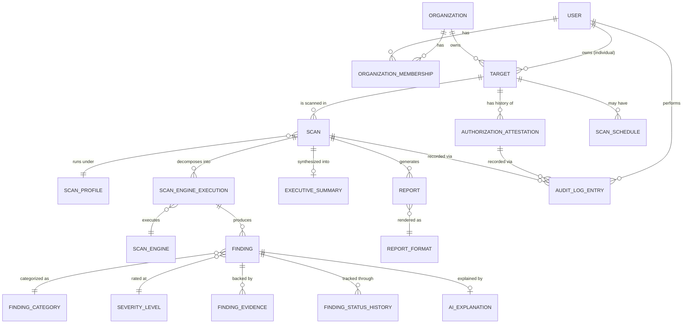
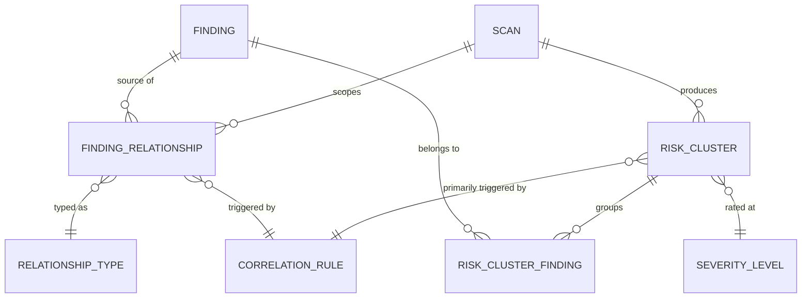

# Software Requirements Specification
## AI-Assisted Vulnerability Assessment Platform

**Document Type:** Software Requirements Specification (SRS)
**Chapter:** 4 — Database Design (ERD + Schema)
**Version:** 2.0 (Revised Draft)
**Status:** For Review
**Prerequisite:** Chapter 1 (Foundations), Chapter 2 (System Architecture), Chapter 3 (Technology Stack & Coding Standards)

> **Design Philosophy for this Chapter:** A vulnerability assessment is not a single event — it's a recurring, evolving relationship between a target and its owner over time. A schema built only for "run a scan, show results" would work for v1.0's feature list but would need painful migrations the moment the product needs trend tracking, re-scans, tool-version reproducibility, or authorization renewal. This chapter instead models the **full lifecycle of a scan** — from authorization, through execution (per-engine, not just per-scan), through a finding's life across multiple scans (new → persistent → resolved → regressed), through AI interpretation, to final reporting and audit — so that today's features are a subset of what the schema supports, not the boundary of it.

---

## Table of Contents

1. Lifecycle-Driven Design Rationale
2. Entity-Relationship Diagram (Full)
3. Lookup / Reference Tables
4. Core Entity Schemas
5. Scan Execution Granularity (Engine-Level Tracking)
6. Finding Identity & Lifecycle Across Scans
7. AI Explanation & Executive Summary Schema
8. Authorization Attestation Schema (Versioned)
9. Reporting Schema
10. Audit Log Schema (Append-Only)
11. Scheduling & Recurrence Schema (Forward-Looking)
12. Indexing Strategy
13. Constraints & Data Integrity Rules
14. Migration & Evolution Strategy
15. Correlation & Risk Cluster Schema (Architectural Extension)

---

## 1. Lifecycle-Driven Design Rationale

Before the tables, the reasoning that shapes every table below:

| Lifecycle Reality | Naive (feature-driven) approach | Lifecycle-driven approach used here |
|---|---|---|
| A scan runs multiple engines (Katana, Nuclei, Nikto, headers, SSL, DNS, WHOIS), and any one can fail independently. | Store one `status` column on `Scan`. | A separate `scan_engine_execution` table tracks each engine's own status, timing, tool version, and exit code — `Scan.status` is *derived* from these, never the sole source of truth (Section 5). |
| The same vulnerability often reappears across multiple scans of the same target (or gets fixed, or comes back). | Treat every scan's findings as a fresh, disconnected list. | Findings carry a stable **fingerprint** so the same underlying issue is recognized across scans, enabling `new / persistent / resolved / regressed` status tracking (Section 6) — this is what powers trend dashboards and scan comparison (Chapter 1, FR-17, US-13). |
| Authorization to scan a target is not permanent — ownership can change, attestations can lapse, methods of proof will evolve (self-attestation today, DNS-TXT verification later per Chapter 1's Future Enhancements). | One boolean `is_authorized` flag on `Target`. | Authorization is its own **versioned, timestamped entity** (`authorization_attestation`) with a method, expiry, and status — a `Target` can have a history of attestations, and new attestation methods can be added without schema change (Section 8). |
| Scan tooling versions change (Nuclei templates update weekly; Katana/Nikto get new releases) and this affects reproducibility and audit defensibility. | Don't record tool versions. | Every engine execution records the exact tool/template version used (`scan_engine.version`, `scan_engine_execution.tool_version_snapshot`), so "what exactly ran on March 3rd" is always answerable (Section 5, Section 10). |
| AI explanations must be traceable, and prompt/model versions will change over time as Gemini model tiers evolve (Chapter 3, Section 4). | Store explanation text with no model/version metadata. | `ai_explanation` records model name, model tier, prompt template version, and validation status per explanation (Section 7). |
| Recurring/scheduled scanning is explicitly a near-term future enhancement (Chapter 1, Section 14; FR-21). | Add scheduling tables later, migrate painfully. | A minimal `scan_schedule` table is included now, unused by v1.0 UI but structurally ready (Section 11). |
| Severity scales, finding categories, and report formats will need new values without redeploying application code. | Hardcode enums in application code. | These are modeled as **lookup tables** (Section 3), not native DB enums, so a new severity tier or category can be added via data insert, not a schema migration. |

---

## 2. Entity-Relationship Diagram (Full)

---

## 3. Lookup / Reference Tables

These are deliberately kept as **data**, not application-level enums or DB-native `ENUM` types, so new values (a new severity tier, a new finding category, a new engine, a new report format) can be added by inserting a row — no code deployment or schema migration required. This directly supports the "not driven solely by today's features" mandate.

### 3.1 `severity_level`
| Column | Type | Notes |
|---|---|---|
| `id` | smallint PK | Stable numeric ordering (e.g., 0=Info, 1=Low, 2=Medium, 3=High, 4=Critical) |
| `code` | varchar(20) unique | `INFO`, `LOW`, `MEDIUM`, `HIGH`, `CRITICAL` |
| `label` | varchar(50) | Display label |
| `rank` | smallint | Sort/comparison order — allows inserting a new tier between existing ones without renumbering |

### 3.2 `finding_category`
| Column | Type | Notes |
|---|---|---|
| `id` | int PK | |
| `code` | varchar(50) unique | e.g., `MISSING_SECURITY_HEADER`, `OUTDATED_TLS`, `KNOWN_CVE`, `EXPOSED_ADMIN_PANEL`, `DNS_MISCONFIGURATION`, `WEAK_CIPHER` |
| `label` | varchar(100) | Human-readable |
| `description` | text nullable | Used as fallback context for AI grounding when evidence is sparse |

### 3.3 `scan_status`
| Column | Type | Notes |
|---|---|---|
| `id` | int PK | |
| `code` | varchar(30) unique | `PENDING_ATTESTATION`, `QUEUED`, `RUNNING`, `PARTIALLY_COMPLETE`, `SCAN_COMPLETE`, `AI_ANALYSIS`, `REPORT_READY`, `REPORT_READY_DEGRADED`, `REJECTED`, `CANCELLED` — mirrors Chapter 2, Section 10's state machine exactly |

### 3.4 `finding_lifecycle_status`
| Column | Type | Notes |
|---|---|---|
| `id` | int PK | |
| `code` | varchar(20) unique | `NEW`, `PERSISTENT`, `RESOLVED`, `REGRESSED` — see Section 6 |

### 3.5 `scan_engine`
Registry of every pluggable scan engine (Chapter 2/3), including the fixed tools.
| Column | Type | Notes |
|---|---|---|
| `id` | int PK | |
| `code` | varchar(50) unique | `katana`, `nuclei`, `nikto`, `headers-analyzer`, `ssl-inspector`, `dns-lookup`, `whois-lookup`, and any future engine |
| `display_name` | varchar(100) | |
| `category` | varchar(30) | `crawler`, `vulnerability`, `webserver`, `configuration`, `dns`, `registration` |
| `current_version` | varchar(50) | Latest known/approved version, updated via ops process (Chapter 3, Section 17 runbook) |
| `is_active` | boolean | Allows disabling an engine platform-wide without deleting historical data |

### 3.6 `report_format`
| Column | Type | Notes |
|---|---|---|
| `id` | int PK | |
| `code` | varchar(20) unique | `PDF`, `JSON`, `CSV` — extensible for future formats (e.g., `SARIF`, `HTML`) without touching the `report` table structure |

### 3.7 `attestation_method`
| Column | Type | Notes |
|---|---|---|
| `id` | int PK | |
| `code` | varchar(30) unique | `SELF_ATTESTATION` (v1.0), `DNS_TXT_CHALLENGE`, `FILE_UPLOAD_VERIFICATION` (future — Chapter 1, Section 14) |
| `requires_manual_review` | boolean | |

---

## 4. Core Entity Schemas

### 4.1 `user`
| Column | Type | Constraints |
|---|---|---|
| `id` | uuid PK | default `gen_random_uuid()` |
| `email` | varchar(255) | unique, not null |
| `password_hash` | varchar(255) | not null (argon2/bcrypt) |
| `mfa_enabled` | boolean | default false |
| `mfa_secret_encrypted` | text nullable | field-level encrypted |
| `is_active` | boolean | default true |
| `created_at` | timestamptz | not null, default now() |
| `updated_at` | timestamptz | not null, default now(), auto-updated |

### 4.2 `organization`
| Column | Type | Constraints |
|---|---|---|
| `id` | uuid PK | |
| `name` | varchar(255) | not null |
| `created_at` | timestamptz | not null |
| `updated_at` | timestamptz | not null |

### 4.3 `organization_membership`
| Column | Type | Constraints |
|---|---|---|
| `id` | uuid PK | |
| `organization_id` | uuid FK → organization.id | not null, on delete cascade |
| `user_id` | uuid FK → user.id | not null, on delete cascade |
| `role` | varchar(20) | not null; `ADMIN` \| `MEMBER` (kept simple as a check constraint rather than a lookup table since role taxonomy is intentionally minimal and access-control-critical, not a growing catalog) |
| `created_at` | timestamptz | not null |

*Unique constraint on (`organization_id`, `user_id`).*

### 4.4 `target`
| Column | Type | Constraints |
|---|---|---|
| `id` | uuid PK | |
| `owner_organization_id` | uuid FK → organization.id | nullable |
| `owner_user_id` | uuid FK → user.id | nullable (exactly one of org/user set — check constraint) |
| `hostname` | varchar(255) | not null |
| `normalized_url` | varchar(500) | not null — canonicalized form used for SSRF-safe resolution (Chapter 2/3) |
| `created_at` | timestamptz | not null |
| `is_archived` | boolean | default false — soft-delete pattern so historical scans remain valid even if a target is later removed from active use |

*Unique constraint on (`owner_organization_id`, `owner_user_id`, `normalized_url`) to prevent duplicate target registration within the same owning entity.*

---

## 5. Scan Execution Granularity (Engine-Level Tracking)

This is the structural core of the lifecycle-driven approach: **a scan is a container; the engine executions are where the truth lives.**

### 5.1 `scan_profile`
| Column | Type | Notes |
|---|---|---|
| `id` | int PK | |
| `code` | varchar(30) unique | `quick-check`, `standard`, `full-assessment` (Chapter 2, Section 5.3) |
| `included_engine_ids` | int[] (or join table `scan_profile_engine`) | Which engines run under this profile |

*Note: modeled as a join table `scan_profile_engine(scan_profile_id, scan_engine_id, execution_order)` in the physical schema rather than an array column, to preserve referential integrity and support ordered execution.*

### 5.2 `scan`
| Column | Type | Constraints |
|---|---|---|
| `id` | uuid PK | |
| `target_id` | uuid FK → target.id | not null |
| `scan_profile_id` | int FK → scan_profile.id | not null |
| `initiated_by_user_id` | uuid FK → user.id | not null |
| `authorization_attestation_id` | uuid FK → authorization_attestation.id | not null — the *specific* attestation validated at scan-start time, not just "target is authorized" |
| `status_id` | int FK → scan_status.id | not null |
| `parent_scan_id` | uuid FK → scan.id, nullable | self-referential — links a re-scan to the prior scan of the same target for comparison (Chapter 1, FR-17) |
| `queued_at` | timestamptz nullable | |
| `started_at` | timestamptz nullable | |
| `completed_at` | timestamptz nullable | |
| `created_at` | timestamptz | not null |

**Design note:** `scan.status_id` is a **cached/derived summary**, recomputed from the aggregate of its `scan_engine_execution` rows (all succeeded → `SCAN_COMPLETE`; any failed but not all → `PARTIALLY_COMPLETE`; etc.). It is stored (not computed on every read) for query performance on dashboards/history views, but the engine-execution rows remain the source of truth and are what audit/dispute resolution actually references.

### 5.3 `scan_engine_execution`
This table is what makes the schema lifecycle-driven rather than feature-driven: it captures **exactly what ran, with what tool version, for how long, with what result** — independent of whatever the current UI happens to display.

| Column | Type | Constraints |
|---|---|---|
| `id` | uuid PK | |
| `scan_id` | uuid FK → scan.id | not null |
| `scan_engine_id` | int FK → scan_engine.id | not null |
| `tool_version_snapshot` | varchar(50) | not null — exact version used for *this* execution, independent of `scan_engine.current_version` which may change later |
| `status` | varchar(20) | `PENDING`, `RUNNING`, `SUCCEEDED`, `FAILED`, `TIMED_OUT` |
| `exit_code` | int nullable | raw process exit code (Chapter 3, Section 13) |
| `started_at` | timestamptz nullable | |
| `completed_at` | timestamptz nullable | |
| `raw_output_storage_ref` | varchar(500) nullable | pointer into object storage for the full raw tool output (not stored inline in the relational DB) |
| `error_message` | text nullable | sanitized (no secrets) failure detail |

*Index on (`scan_id`, `scan_engine_id`).*

---

## 6. Finding Identity & Lifecycle Across Scans

A "finding" in this platform is not just a row produced by one scan — it is a **recurring identity** that must be recognizable across multiple scans of the same target so that trend/history features (Chapter 1, US-13, US-14; FR-17) work without redesign.

### 6.0A `scanner_observation` (normalized observation layer)
The observation layer preserves what a scanner actually reported before the system treats it as a candidate vulnerability finding. This avoids conflating reconnaissance/exposure observations with verified vulnerabilities.

| Column | Type | Constraints |
|---|---|---|
| `id` | uuid PK | |
| `scan_engine_execution_id` | uuid FK → scan_engine_execution.id | not null |
| `scan_id` | uuid FK → scan.id | not null |
| `asset_identity` | varchar(500) | not null |
| `location_json` | jsonb | nullable | URL/path/port/protocol information as applicable |
| `observation_type` | varchar(80) | not null | e.g. `OPEN_PORT`, `WEB_PATH`, `TEMPLATE_MATCH`, `TECHNOLOGY_VERSION` |
| `normalized_data` | jsonb | not null | lossless normalized representation |
| `raw_reference` | varchar(500) | not null | pointer into raw output/artifact storage |
| `confidence` | numeric(5,4) | nullable | confidence in the observation, not vulnerability severity |
| `observed_at` | timestamptz | not null | |

**Invariant:** observations are immutable evidence records. Promotion to a `finding` does not delete or overwrite the originating observation.

### 6.1 `finding`
| Column | Type | Constraints |
|---|---|---|
| `id` | uuid PK | Unique per occurrence-record (one row per scan in which it appeared) |
| `scan_engine_execution_id` | uuid FK → scan_engine_execution.id | not null — traces back to exactly which tool run produced it |
| `scan_id` | uuid FK → scan.id | not null (denormalized for query convenience) |
| `target_id` | uuid FK → target.id | not null (denormalized — simplifies cross-scan trend queries without joining through scan) |
| `finding_category_id` | int FK → finding_category.id | not null |
| `severity_level_id` | smallint FK → severity_level.id | not null |
| `fingerprint` | varchar(128) | not null — stable hash of (target, category, normalized identifier — e.g., CVE ID, header name, misconfig type, affected path). **This is what links occurrences of the same underlying issue across different scans.** |
| `title` | varchar(255) | not null |
| `affected_asset` | varchar(500) nullable | specific URL/endpoint/field affected |
| `source_engine_code` | varchar(50) | denormalized copy of `scan_engine.code` at time of finding, for quick filtering (e.g., distinguishing Nuclei vs. Nikto findings per Chapter 3, Section 3) |
| `created_at` | timestamptz | not null |

*Index on `fingerprint` (critical for lifecycle-status computation below). Index on (`target_id`, `fingerprint`, `created_at`) for trend queries.*

### 6.2 `finding_status_history`
Rather than a single mutable `status` column on `finding`, lifecycle transitions are recorded as an append-style history, because "when did this become resolved, and in which scan was that determined" is itself a piece of evidence a user (or auditor) may need.

| Column | Type | Constraints |
|---|---|---|
| `id` | uuid PK | |
| `fingerprint` | varchar(128) | not null — tracks status at the fingerprint level, not the per-occurrence `finding.id` level |
| `target_id` | uuid FK → target.id | not null |
| `finding_lifecycle_status_id` | int FK → finding_lifecycle_status.id | not null |
| `observed_in_scan_id` | uuid FK → scan.id | not null — the scan that caused this status determination |
| `effective_at` | timestamptz | not null |

**How lifecycle status is derived (application logic, not a DB trigger, to keep the rule visible/testable in code per Chapter 3 standards):**
- A fingerprint appearing for the **first time ever** for a target → `NEW`.
- A fingerprint appearing in this scan **and** the immediately preceding scan of the same target → `PERSISTENT`.
- A fingerprint present in a prior scan but **absent** in the current scan → `RESOLVED`.
- A fingerprint marked `RESOLVED` in some prior scan that **reappears** in a later scan → `REGRESSED`.

This is precisely why `scan.parent_scan_id` (Section 5.2) exists — it gives the comparison logic an explicit "previous scan" to diff against rather than inferring it from timestamps alone.

### 6.3 `finding_evidence`
Immutable evidence snippets backing a finding — kept separate from `finding` itself so evidence (which can be large/verbose) doesn't bloat the primary query path, and so a single finding can carry multiple evidence fragments (e.g., a Nuclei match plus a Nikto corroboration).

| Column | Type | Constraints |
|---|---|---|
| `id` | uuid PK | |
| `finding_id` | uuid FK → finding.id | not null |
| `evidence_type` | varchar(30) | `RAW_HEADER`, `TOOL_OUTPUT_SNIPPET`, `CERTIFICATE_DETAIL`, `DNS_RECORD`, `HTTP_RESPONSE_FRAGMENT` |
| `content` | text | not null — the actual evidence text/snippet (this is what the AI layer is grounded against, per Chapter 2, Section 6) |
| `created_at` | timestamptz | not null |

---

## 7. AI Explanation & Executive Summary Schema

Directly implements the evidence-grounding and traceability requirements from Chapter 1 (NFR-17) and Chapter 2/3 (Section 6 / Section 14).

### 7.1 `ai_explanation`
| Column | Type | Constraints |
|---|---|---|
| `id` | uuid PK | |
| `finding_id` | uuid FK → finding.id | not null, unique (one explanation per finding-occurrence; re-analysis creates a new `finding` reference only via re-running the scan, not by mutating this row) |
| `model_name` | varchar(50) | not null — e.g., `gemini-2.5-flash-lite` (MVP default, Chapter 3, Section 4) |
| `model_tier` | varchar(20) | `fast` \| `reasoning` (Chapter 3, Section 4 tiering convention) |
| `prompt_template_version` | varchar(20) | not null — points to the version-controlled prompt file used (Chapter 3, Section 14) |
| `explanation_text` | text | not null — the rendered, human-readable explanation (claims joined into prose for display) |
| `claims_json` | jsonb | not null — the structured `[{text, evidenceReferences: [finding_evidence.id, ...]}]` array the model actually returned (Chapter 9, Section 4); `explanation_text` is derived from this, not the other way around, so the specific evidence-ID grounding behind the prose is never lost to formatting |
| `remediation_text` | text | not null |
| `validation_status` | varchar(20) | `VALIDATED`, `FALLBACK_USED` — records whether this passed the response validator or fell back to a deterministic template (Chapter 2, Section 6.2) |
| `generated_at` | timestamptz | not null |

**Why `claims_json` exists alongside `explanation_text`:** storing only rendered prose would discard the specific evidence-ID grounding behind each claim after validation, recoverable only by re-reading the prompt log if at all. `claims_json` keeps that structured, per-claim evidence linkage as queryable data — it's what the validator actually checks (Chapter 9, Section 5), and what a future "show exactly which evidence backs this" UI feature would read from directly.

### 7.2 `executive_summary`
| Column | Type | Constraints |
|---|---|---|
| `id` | uuid PK | |
| `scan_id` | uuid FK → scan.id | not null, unique |
| `model_name` | varchar(50) | not null |
| `prompt_template_version` | varchar(20) | not null |
| `summary_text` | text | not null |
| `top_priority_finding_ids` | uuid[] | references into `finding.id` — top N findings surfaced in the summary narrative |
| `generated_at` | timestamptz | not null |

---

## 8. Authorization Attestation Schema (Versioned)

Authorization is modeled as a **history**, not a flag, because attestation methods will evolve (Chapter 1, Future Enhancements) and because a target's authorization status can lapse or be renewed — and every scan must reference the *specific* attestation that justified it (Section 5.2), for audit defensibility (Chapter 1, R-01, R-05).

### 8.1 `authorization_attestation`
| Column | Type | Constraints |
|---|---|---|
| `id` | uuid PK | |
| `target_id` | uuid FK → target.id | not null |
| `attested_by_user_id` | uuid FK → user.id | not null |
| `attestation_method_id` | int FK → attestation_method.id | not null |
| `status` | varchar(20) | `PENDING_REVIEW`, `CONFIRMED`, `REJECTED`, `EXPIRED`, `REVOKED` |
| `evidence_storage_ref` | varchar(500) nullable | pointer to uploaded proof document, if applicable to the method |
| `confirmed_at` | timestamptz nullable | |
| `expires_at` | timestamptz nullable | supports future policies like "re-attest every 12 months" without schema change |
| `revoked_at` | timestamptz nullable | |
| `created_at` | timestamptz | not null |

**Rule enforced in application logic (Chapter 3, Section 18):** a scan may only be created referencing an attestation with `status = 'CONFIRMED'` and (`expires_at` is null or in the future). This is re-validated at job-dequeue time, not just at request time, consistent with Chapter 2/3's re-validation principle.

---

## 9. Reporting Schema

### 9.1 `report`
| Column | Type | Constraints |
|---|---|---|
| `id` | uuid PK | |
| `scan_id` | uuid FK → scan.id | not null |
| `report_format_id` | int FK → report_format.id | not null |
| `generated_by_user_id` | uuid FK → user.id | not null |
| `storage_ref` | varchar(500) | not null — object storage pointer; the DB never stores the binary/large payload inline |
| `generated_at` | timestamptz | not null |

*A scan can have multiple `report` rows (one PDF, one JSON export, one CSV export, and potentially regenerated versions after an AI re-analysis) — modeled as one-to-many deliberately rather than one report row per scan.*

---

## 10. Audit Log Schema (Append-Only)

### 10.1 `audit_log_entry`
| Column | Type | Constraints |
|---|---|---|
| `id` | uuid PK | |
| `actor_user_id` | uuid FK → user.id, nullable | null for system-initiated events |
| `action_code` | varchar(50) | not null — e.g., `SCAN_REQUESTED`, `ATTESTATION_CONFIRMED`, `SCAN_STATE_TRANSITION`, `REPORT_EXPORTED`, `AUDIT_LOG_ACCESSED` |
| `entity_type` | varchar(30) | not null — e.g., `scan`, `target`, `authorization_attestation` |
| `entity_id` | uuid | not null |
| `metadata_json` | jsonb | not null — structured detail specific to `action_code` (e.g., old/new status for a transition) |
| `occurred_at` | timestamptz | not null |

**Database-level enforcement:** the application's database role is granted `INSERT` only on this table — no `UPDATE` or `DELETE` grant exists at all, enforced via PostgreSQL role permissions, not merely application logic (Chapter 2, Section 12.2; Chapter 3, Section 11).

---

## 11. Scheduling & Recurrence Schema (Forward-Looking)

Not exposed in the v1.0 UI (Chapter 1 lists recurring scans as `Could`-priority, FR-21), but included now at minimal cost so that adding the feature later is a UI + worker-scheduling change, not a schema migration.

### 11.1 `scan_schedule`
| Column | Type | Constraints |
|---|---|---|
| `id` | uuid PK | |
| `target_id` | uuid FK → target.id | not null |
| `scan_profile_id` | int FK → scan_profile.id | not null |
| `cadence` | varchar(20) | `DAILY`, `WEEKLY`, `MONTHLY` |
| `is_active` | boolean | default true |
| `next_run_at` | timestamptz | not null |
| `created_by_user_id` | uuid FK → user.id | not null |

---

## 12. Indexing Strategy

| Table | Index | Rationale |
|---|---|---|
| `scan` | (`target_id`, `created_at` DESC) | Scan history views, "most recent scan for target" lookups (used by `parent_scan_id` resolution) |
| `scan` | (`status_id`) | Dashboard filtering by in-progress/failed scans |
| `scan_engine_execution` | (`scan_id`, `scan_engine_id`) | Per-scan engine-status assembly |
| `finding` | (`fingerprint`) | Core to lifecycle-status computation (Section 6) |
| `finding` | (`target_id`, `fingerprint`, `created_at` DESC) | Trend/comparison queries across scans of the same target |
| `finding` | (`scan_id`, `severity_level_id`) | Per-scan severity breakdown (dashboard) |
| `finding_status_history` | (`target_id`, `fingerprint`, `effective_at` DESC) | "Current status of this issue" lookups |
| `authorization_attestation` | (`target_id`, `status`, `expires_at`) | Scan-creation validation path (Section 8) |
| `audit_log_entry` | (`entity_type`, `entity_id`, `occurred_at` DESC) | "Full history for this scan/target/attestation" reconstruction |
| `report` | (`scan_id`) | Report retrieval per scan |

All foreign key columns are indexed by default per Chapter 3, Section 11's standing convention, in addition to the composite indexes above.

---

## 13. Constraints & Data Integrity Rules

- **`target`**: check constraint ensuring exactly one of `owner_organization_id` / `owner_user_id` is non-null (a target belongs to exactly one owning entity, never both, never neither).
- **`scan`**: foreign key to `authorization_attestation` is `NOT NULL` — a scan literally cannot exist in the schema without a referenced attestation record, making unauthorized-scan-by-construction impossible at the data layer, not just the application layer.
- **`scan_engine_execution`**: `completed_at` must be null while `status IN ('PENDING','RUNNING')` and non-null otherwise (check constraint) — prevents inconsistent partial states from being persisted.
- **`finding`**: `fingerprint` is never null or empty — enforced via `NOT NULL` + check constraint (`length(fingerprint) > 0`), since the entire lifecycle-tracking model in Section 6 depends on it.
- **`ai_explanation`**: unique constraint on `finding_id` — one explanation per finding-occurrence, preventing duplicate/conflicting AI output for the same finding row.
- **`audit_log_entry`**: no `UPDATE`/`DELETE` privilege at the database role level (Section 10) — the strongest available integrity guarantee for this table, since it must survive even a bug in application code.
- **Referential cascade policy:** `ON DELETE CASCADE` is used only for organization-membership-style join records; all scan-lifecycle tables (`scan`, `finding`, `authorization_attestation`, `audit_log_entry`) use `ON DELETE RESTRICT` on their target/scan references — a `target` cannot be hard-deleted while scans reference it (Section 4.4's `is_archived` soft-delete exists precisely to avoid ever needing to violate this).

---

## 14. Migration & Evolution Strategy

- All schema changes go through Alembic per Chapter 3, Section 11 — this chapter's tables are the **v1.0 baseline migration**, not a final state.
- **Adding a new scan engine** (e.g., a future cloud-config checker) requires only a new row in `scan_engine` and, if needed, a new `scan_profile_engine` mapping — no structural migration.
- **Adding a new severity tier or finding category** is a data insert into `severity_level` / `finding_category`, not a migration.
- **Adding a new attestation method** (e.g., DNS-TXT verification, per Chapter 1's Future Enhancements) is a data insert into `attestation_method` plus new application logic to populate `evidence_storage_ref` appropriately — the `authorization_attestation` table itself needs no structural change.
- **Anticipated future migration**, flagged now rather than discovered later: if/when compliance-framework mapping (Chapter 1, Future Enhancements) is built, a `finding_compliance_mapping` join table (`finding_category_id` ↔ `compliance_control_id`) would attach cleanly to the existing `finding_category` lookup table without touching `finding` itself — validating that today's lookup-table-based design already anticipates that extension.

---

## 15. Correlation & Risk Cluster Schema (Architectural Extension)

> **Extension rationale:** Chapter 8, Section 11 introduces a deterministic Correlation Engine that identifies relationships between findings already collected on the same target (e.g., an exposed admin panel co-located with a missing authentication control and an outdated, fingerprinted web server). This section gives that engine's output somewhere durable and queryable to live, following the same lookup-table extensibility pattern used throughout this chapter — a new relationship type or correlation rule is a data insert, not a migration, exactly like a new severity tier or finding category (Section 14). **`finding_relationship` (Section 15.3) is now the single canonical mechanism for every kind of inter-finding relationship** — including cross-engine deduplication (Chapter 8, Section 5), which previously used an ad-hoc `finding_evidence` metadata annotation. That earlier mechanism is retired; there is exactly one place a relationship between two findings can live.

### 15.1 `relationship_type`
Lookup table (Section 3 pattern) — the vocabulary of how two findings can relate. Kept deliberately small — three categories, not a fine-grained taxonomy — since a richer vocabulary wasn't earning its complexity for an MVP.
| Column | Type | Notes |
|---|---|---|
| `id` | int PK | |
| `code` | varchar(30) unique | `DUPLICATE` — two engines independently reporting the same underlying issue (Chapter 8, Section 5's cross-engine dedup writes this type). `CORROBORATES` — independent evidence supports the same underlying finding without requiring the observations to be identical. `RELATED` — a looser association a correlation rule flagged that doesn't rise to forming a full risk cluster; reserved for future rule types, not produced by any MVP rule. `CORRELATED` — this finding is a member of a `risk_cluster` (Chapter 8, Section 11's rules all produce this type). |
| `label` | varchar(100) | Human-readable |

### 15.1A Canonical relationship-model invariant

`finding_relationship` is the **single canonical persistence mechanism for relationships between findings**. Cross-engine duplicates, deterministic correlations, and future relationship types must not be represented through ad-hoc evidence metadata or parallel relationship tables. `finding_evidence` stores evidence; `finding_relationship` stores relationships. This distinction prevents competing sources of truth and keeps correlation results auditable.

### 15.2 `correlation_rule`
The deterministic, version-controlled ruleset the Correlation Engine evaluates (Chapter 8, Section 11) — governed exactly like the `nuclei_template_id` mapping (Chapter 8, Section 3.2) and `fingerprint_identifier_rules.py` (Chapter 8, Section 6): reviewed, checked into version control, never AI-authored. Every MVP category-pair rule sets `relationship_type_id` to `CORRELATED`. Cross-engine deduplication (Chapter 8, Section 5) is represented by one **reserved system row** — `code = 'CROSS_ENGINE_DEDUP'`, `relationship_type_id = DUPLICATE` — rather than a category-pair rule, so `DUPLICATE` edges still satisfy `finding_relationship.triggered_by_rule_id`'s `NOT NULL` constraint below: every relationship in the graph, without exception, traces back to a named, versioned mechanism.
| Column | Type | Constraints |
|---|---|---|
| `id` | int PK | |
| `code` | varchar(50) unique | e.g., `EXPOSED_ADMIN_PLUS_WEAK_AUTH` |
| `description` | text | Human-readable statement of what the rule detects and why it matters — also used verbatim as the deterministic fallback narrative (Chapter 9, Section 12.2) |
| `condition_category_a_id` | int FK → finding_category.id | not null |
| `condition_category_b_id` | int FK → finding_category.id, nullable | null for single-category rules (e.g., "3+ findings of category X on one asset") |
| `requires_same_asset` | boolean | default true — almost every v1.0 rule requires co-location on the same `affected_asset`/target |
| `relationship_type_id` | int FK → relationship_type.id | not null |
| `cluster_severity_floor_id` | smallint FK → severity_level.id, nullable | minimum severity a resulting `risk_cluster` is assigned, regardless of individual finding severities |
| `is_active` | boolean | default true |
| `rule_version` | varchar(20) | not null — mirrors `tool_version_snapshot`'s reproducibility purpose: which rule version produced a given relationship is always answerable |

### 15.3 `finding_relationship`
| Column | Type | Constraints |
|---|---|---|
| `id` | uuid PK | |
| `scan_id` | uuid FK → scan.id | not null — relationships are scoped to a single scan's finding set, never inferred across scans |
| `finding_id_a` | uuid FK → finding.id | not null |
| `finding_id_b` | uuid FK → finding.id | not null |
| `relationship_type_id` | int FK → relationship_type.id | not null |
| `triggered_by_rule_id` | int FK → correlation_rule.id | not null — every edge in the graph traces back to the exact deterministic rule that produced it; there is no path for a relationship to exist without one |
| `created_at` | timestamptz | not null |

*Check constraint: `finding_id_a <> finding_id_b` (a finding cannot relate to itself). Unique constraint on (`finding_id_a`, `finding_id_b`, `relationship_type_id`) to prevent duplicate edges from overlapping rule matches.*

### 15.4 `risk_cluster`
A named grouping of related findings — the persisted form of what Chapter 8, Section 11 calls the Security Assessment Graph's "related risk cluster."
| Column | Type | Constraints |
|---|---|---|
| `id` | uuid PK | |
| `scan_id` | uuid FK → scan.id | not null |
| `target_id` | uuid FK → target.id | not null (denormalized, matching the `finding` table's existing convention in Section 6.1) |
| `title` | varchar(255) | not null — generated from the triggering rule's description, not free-form AI text (Chapter 9, Section 12) |
| `narrative` | text nullable | AI-explained relationship narrative once generated (Chapter 9, Section 12.1); null until then, never blocking the cluster's existence |
| `cluster_severity_level_id` | smallint FK → severity_level.id | not null |
| `primary_rule_id` | int FK → correlation_rule.id | not null |
| `created_at` | timestamptz | not null |

### 15.5 `risk_cluster_finding`
Join table associating findings with the cluster(s) they belong to (a finding may participate in more than one cluster).
| Column | Type | Constraints |
|---|---|---|
| `risk_cluster_id` | uuid FK → risk_cluster.id | not null |
| `finding_id` | uuid FK → finding.id | not null |

*Composite primary key on (`risk_cluster_id`, `finding_id`).*

### 15.6 Supplementary ERD

### 15.7 Indexing & Integrity (extends Sections 12–13)

| Table | Index | Rationale |
|---|---|---|
| `finding_relationship` | (`scan_id`), (`finding_id_a`), (`finding_id_b`) | Graph traversal from either a scan or a specific finding |
| `risk_cluster` | (`scan_id`, `cluster_severity_level_id`) | Dashboard "highest-risk cluster" queries, mirroring the existing `finding` severity-breakdown index |
| `risk_cluster_finding` | (`finding_id`) | "Which clusters is this finding part of" lookups from a finding-detail view |

**Integrity rule consistent with Section 13's pattern:** `finding_relationship.triggered_by_rule_id` and `risk_cluster.primary_rule_id` are `NOT NULL` — exactly as `scan.authorization_attestation_id` makes an unauthorized scan impossible to persist, an untraceable (rule-less) relationship or cluster is impossible to persist. Every edge and every cluster is provably the output of a named, versioned, reviewed rule — never a free-standing claim.

### 15.8 Extensibility

Adding a new correlation rule (e.g., recognizing a new dangerous combination the team identifies after launch) is a data insert into `correlation_rule` referencing existing `finding_category` rows — no migration, following the exact pattern established for every other lookup table in this chapter (Section 14).

---

*End of Chapter 4. Chapter 5 (API Specification) will define the concrete REST endpoints, request/response schemas, and status codes that operate over the entities defined here — including how `scan_engine_execution` status aggregation is exposed via the real-time progress channel from Chapter 2, Section 8.*
