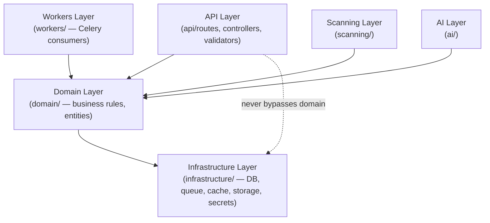
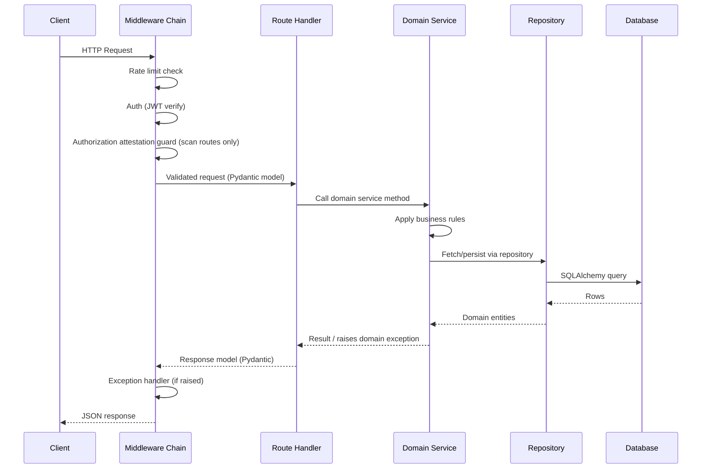
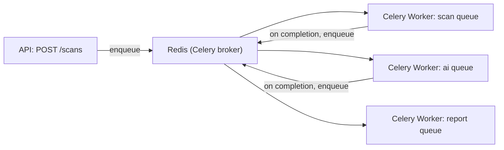

# Software Requirements Specification
## AI-Assisted Vulnerability Assessment Platform

**Chapter 6 — Backend Architecture**
**Version:** 1.0 (Draft) | **Status:** For Review
**Prerequisite:** Chapters 1–5

> This chapter goes one level deeper than Chapter 2 (System Architecture) and Chapter 3 (Technology Stack) into how the **FastAPI backend itself is structured internally** — layering, request lifecycle, configuration, background processing, and the discipline that keeps `domain/` logic persistence- and framework-agnostic as required by Chapter 3, Sections 9–11.

---

## Table of Contents

1. Layered Architecture Overview
2. Request Lifecycle (Anatomy of a Request)
3. Layer Responsibilities & Boundaries
4. Dependency Injection Strategy
5. Configuration & Environment Management
6. Background Processing Architecture (Celery)
7. Domain Model vs. Persistence Model
8. Service Layer Design Patterns
9. Cross-Cutting Concerns
10. Health Checks & Readiness
11. Backend Module Dependency Rules

---

## 1. Layered Architecture Overview

The backend follows a **four-layer architecture**, matching the folder structure locked in Chapter 3, Section 3:

**Rule:** the API layer never talks to Infrastructure directly for business operations — it always goes through Domain. The only exception is framework-level concerns (e.g., a health-check route pinging the DB connection directly), which are explicitly exempted and documented as such.

---

## 2. Request Lifecycle (Anatomy of a Request)

Every middleware in the chain is composable and independently testable — the `authorizationAttestationGuard` (Chapter 2/4/5) is a named, reusable dependency injected only into routes that create or act on scans, not globally applied.

---

## 3. Layer Responsibilities & Boundaries

| Layer | Owns | Must Not Do |
|---|---|---|
| **API** (`api/`) | Route definition, request/response schema validation (Pydantic), HTTP status mapping, auth/rate-limit middleware wiring | Contain business rules (e.g., "is this attestation still valid" logic lives in Domain, not in a route handler) |
| **Domain** (`domain/`) | Business rules, entity behavior, the scan lifecycle state machine, attestation validity rules, finding lifecycle-status computation (Chapter 4, Section 6.2) | Import SQLAlchemy models directly, know about HTTP, know about Celery |
| **Infrastructure** (`infrastructure/`) | DB session management, repository implementations, queue publishing, cache access, object storage client, secrets client | Contain business rules |
| **Scanning** (`scanning/`) | Engine registry, sandbox orchestration, per-tool wrappers, and the deterministic Correlation Engine (Chapter 8, Sections 1 & 11) | Make final severity/lifecycle decisions — it produces normalized findings and rule-triggered relationships; Domain decides what they mean. The Correlation Engine specifically never calls an LLM or makes a network request — either would misplace its logic in `ai/` or the sandbox. |
| **AI** (`ai/`) | Prompt building, Gemini client, response validation (Chapter 9) | Persist directly to DB — returns validated results to the calling Domain service, which persists via a repository |
| **Workers** (`workers/`) | Celery task definitions, job-level error handling, dispatch to Scanning/AI/Domain | Contain business rules beyond orchestration sequencing |

---

## 4. Dependency Injection Strategy

FastAPI's `Depends()` system is the single DI mechanism used throughout:

- **Request-scoped dependencies:** DB session (`get_db_session`), current authenticated user (`get_current_user`), current organization context (`get_org_context`).
- **Singleton-scoped dependencies:** Gemini client, object storage client, Redis client — instantiated once at application startup and injected via FastAPI's dependency-caching behavior, avoiding per-request connection overhead.
- **Guard dependencies:** `authorizationAttestationGuard`, `rateLimitGuard`, `roleRequired(role)` — composable dependencies attached per-route, not global middleware, so their applicability is visible directly in the route signature (self-documenting authorization requirements).
- **Testing implication:** every dependency is overridable via FastAPI's `dependency_overrides`, which is how integration tests (Chapter 13) substitute a test DB session and a mocked Gemini client without touching route code.

---

## 5. Configuration & Environment Management

- **`config/env.ts`-equivalent (`config/settings.py`)** uses Pydantic's `BaseSettings` to load and validate all environment variables at startup — the application fails fast on missing/malformed configuration rather than failing deep in a request handler.
- **Environment tiers:** `local`, `test`, `staging`, `production` — each with its own settings profile; secrets (Gemini API key, DB credentials, object storage keys) are never part of the settings file itself, only *references* resolved through the secrets manager client (Chapter 3, Section 7) at startup.
- **Feature flags:** a minimal flag mechanism (config-driven, not a full flag-service in v1.0) allows disabling a specific scan engine or the AI layer platform-wide (falling back to non-AI reports) without a deployment, useful during a Gemini outage or a problematic Nuclei template update.

---

## 6. Background Processing Architecture (Celery)

- **Separate queues per concern** (`scan`, `ai`, `report`) rather than one shared queue — this lets the platform scale scan workers (CPU/IO-bound, tool-execution-heavy) independently from AI workers (network-bound, rate-limited by Gemini quota) and report workers (memory-bound, PDF rendering), matching Chapter 2, Section 14's scalability principle.
- **Task chaining:** scan execution → correlation (Chapter 8, Section 11, run synchronously inside the same scan-worker task — see below) → (on success/partial-success) AI analysis task auto-enqueued → (on completion) executive summary task — implemented via Celery's `chain`/`chord` primitives rather than a hand-rolled polling loop, so failures at any stage are individually retryable.
- **Why correlation doesn't get its own queue:** unlike AI calls (network-bound, rate-limited by Gemini) or report rendering (memory-heavy), the Correlation Engine is fast, in-process, deterministic computation over findings the scan worker has already fetched — no external I/O of any kind. Giving it a dedicated queue would add inter-process latency and operational surface for no benefit; it runs as the last step of the `scan` queue's own task, immediately before the AI task is enqueued.
- **Retry policy:** transient failures (DB connection blip, Gemini rate-limit `429`) use exponential backoff with a bounded max-retry count; tool-execution failures (Nuclei timeout) do **not** auto-retry the whole scan — they're recorded as a `FAILED` `scan_engine_execution` and the scan proceeds, per Chapter 4/Chapter 3's partial-failure design.
- **Task idempotency:** every task is written to be safely re-runnable (checked via the `scan_engine_execution.status` guard — a task that finds its target row already `SUCCEEDED` no-ops) to tolerate at-least-once delivery semantics from the broker.

---

## 7. Domain Model vs. Persistence Model

Per Chapter 3, Section 11's repository-pattern requirement:

- **Domain entities** (`domain/scans/scan.entity.py`, etc.) are plain Python classes/dataclasses expressing business state and behavior — e.g., `Scan.can_transition_to(new_status)`.
- **Persistence models** (`infrastructure/database/scan_models.py`) are SQLAlchemy `Mapped[...]` classes matching Chapter 4's schema exactly.
- **Repositories** translate between the two directions: `ScanRepository.get_by_id()` returns a Domain entity (not a SQLAlchemy row); `ScanRepository.save(entity)` maps back to the persistence model for the actual `INSERT`/`UPDATE`.
- **Why this split matters here specifically:** the scan-state machine (Chapter 2, Section 10) and finding lifecycle-status logic (Chapter 4, Section 6.2) are pure business rules that must be unit-testable without spinning up a database — this split is what makes that possible, and it's a named CI test-coverage target in Chapter 3, Section 15.

---

## 8. Service Layer Design Patterns

| Pattern | Where Used | Why |
|---|---|---|
| **State machine** | `ScanLifecycleService` | Enforces valid transitions only (Chapter 2, Section 10) — an illegal transition (e.g., `REJECTED` → `RUNNING`) raises a domain exception rather than silently succeeding. |
| **Strategy pattern** | Engine registry (`scanning/engineRegistry.py`) | Each engine wrapper implements the same interface; the orchestrator doesn't know or care whether it's calling Katana or the internal headers analyzer. |
| **Strategy pattern (2nd instance)** | `SandboxRunner` abstraction (`scanning/sandbox/runner.py`) — `DockerSandboxRunner` (MVP) and `KubernetesSandboxRunner` (future, Chapter 12) | The worker calls `SandboxRunner.provision(target)` / `.teardown()` without knowing which implementation is behind it. Concretely, this is what a Celery worker process depends on instead of holding Docker socket access directly (Chapter 3, Section 18) — swapping to Kubernetes later means writing one new class, not touching worker code. |
| **Chain of responsibility** | AI response validation pipeline (Chapter 9) | Schema check → evidence cross-reference → fallback trigger, each stage able to short-circuit. |
| **Unit of Work** | Scan completion transaction | All findings for a completed engine execution are persisted in a single DB transaction, so a partial write can never leave the DB in an inconsistent state (some findings saved, others lost). |
| **Specification pattern** | Attestation validity check (`AttestationSpec.is_valid_for(target, scan_time)`) | Keeps the "is this attestation usable right now" rule in one composable, testable unit reused both at API-request time and job-dequeue time (Chapter 4, Section 8). |
| **Rules engine (deterministic evaluation)** | Correlation Engine (`scanning/correlation/`, Chapter 8, Section 11) | Evaluates persisted findings against version-controlled `correlation_rule` data in plain code, deliberately not model-driven — a `risk_cluster` stays as verifiable as a `finding` itself. |

---

## 9. Cross-Cutting Concerns

- **Logging:** `structlog` context-binds `request_id`, `user_id`, and `scan_id` (when applicable) at the start of the middleware chain, so every log line downstream — across API, worker, scanning, and AI layers — is correlatable to a single request or scan without manual threading.
- **Error translation:** domain exceptions (`AttestationNotConfirmedError`, `InvalidScanTransitionError`) are mapped to HTTP responses by a single centralized FastAPI exception handler registry — no route handler contains its own `try/except → HTTPException` boilerplate.
- **Transactions:** a request-scoped DB session with automatic commit-on-success/rollback-on-exception, managed by the `get_db_session` dependency — service code never manually commits mid-operation.
- **Timezones:** all persistence and API boundaries use UTC exclusively (Chapter 4 schema uses `timestamptz`); any local-time display is a frontend concern only.

---

## 10. Health Checks & Readiness

| Endpoint | Purpose |
|---|---|
| `GET /healthz` | Liveness — process is up, no dependency checks (used by orchestrator restart logic) |
| `GET /readyz` | Readiness — verifies DB connection, Redis connection, and (lightweight) Gemini client configuration validity; used by load balancer/orchestrator to gate traffic |
| `GET /readyz/workers` | Reports last-seen heartbeat per Celery queue, surfaced on internal ops dashboards — not exposed to the frontend, used for on-call visibility into whether scan/AI/report queues are actively being drained |

---

## 11. Backend Module Dependency Rules

Enforced via CI (an import-linter or equivalent static check, run alongside `ruff`/`mypy` per Chapter 3, Section 16):

- `domain/` may **not** import from `api/`, `infrastructure/`, `scanning/`, or `ai/` — it is the innermost, dependency-free layer.
- `scanning/` and `ai/` may import from `domain/` (to return/accept domain entities) but not from each other directly — any coordination between scan results and AI analysis happens through `domain/` or `workers/`.
- This rule applies without exception to the Correlation Engine (`scanning/correlation/`, Chapter 8, Section 11): its output reaches the AI context assembler (Chapter 9, Section 2) exclusively by being persisted through a Domain repository and re-read by `ai/` through its own repository call — never by a direct `scanning/correlation/` → `ai/` import. Chapter 8, Section 11.1's pipeline diagram describes a *data* dependency, flowing through the database, not a code dependency between the two modules.
- `workers/` is the only layer permitted to import from `api/`, `domain/`, `scanning/`, and `ai/` simultaneously, since its role is orchestration across all of them.
- Violations fail the CI build — this is what keeps the architecture diagram in Section 1 true over time rather than aspirational.

---

*End of Chapter 6. Chapter 7 (Frontend Architecture) mirrors this depth for the React/TypeScript client.*
