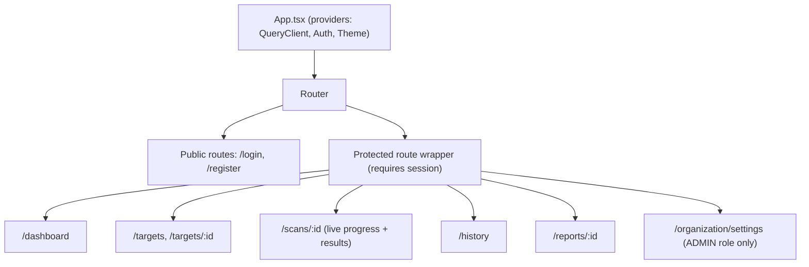
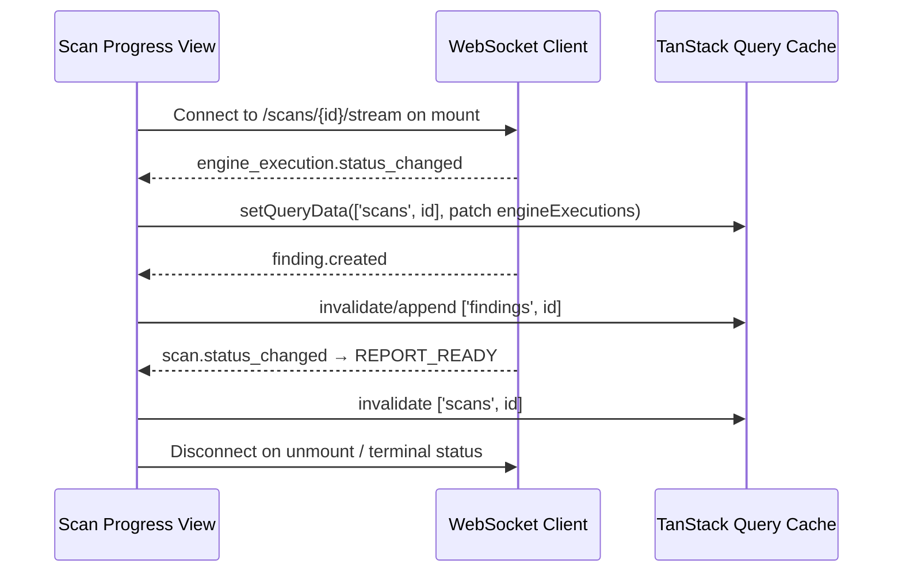

# Software Requirements Specification
## AI-Assisted Vulnerability Assessment Platform

**Chapter 7 — Frontend Architecture**
**Version:** 1.0 (Draft) | **Status:** For Review
**Prerequisite:** Chapters 1–6

> Deepens Chapter 2, Section 4 (folder structure) and Chapter 3, Section 12 (coding standards) into how the React/TypeScript client is actually composed at runtime — state, data flow, real-time updates, and performance.

---

## Table of Contents

1. Application Shell & Routing
2. Feature-Module Architecture
3. State Management Strategy
4. Data Fetching & Caching Layer
5. Real-Time Integration
6. Component Design System
7. Form Handling & Validation
8. Error Boundaries & Loading States
9. Performance Considerations
10. Accessibility Implementation
11. Build & Bundling Strategy

---

## 1. Application Shell & Routing

- A single **Protected Route wrapper** checks session validity before rendering any authenticated route, redirecting to `/login` on a `401` from the initial `GET /auth/me` bootstrap call — no route implements its own auth check.
- **Route-level code splitting** (lazy-loaded route bundles) keeps initial load light; the scan-progress view (heaviest due to real-time wiring) is not loaded until navigated to.

---

## 2. Feature-Module Architecture

Recapping Chapter 2, Section 4's folder structure, the runtime rule is: **a feature module owns its own components, hooks, and API calls, and exposes only what other features need through an explicit `index.ts` barrel.** `scans/` may import the public exports of `findings/` (to render a `FindingCard` inline in a scan view), but never reaches into `findings/components/internal/*` directly. This keeps feature boundaries real, not just directory-deep conventions that erode over time.

---

## 3. State Management Strategy

| State Category | Mechanism | Rationale |
|---|---|---|
| **Server state** (scans, findings, targets, reports — anything from the API) | TanStack Query | Automatic caching, background refetch, and request deduplication; server state is never duplicated into a global store. |
| **Real-time-updated state** (live scan progress) | TanStack Query cache, updated via WebSocket event handlers calling `queryClient.setQueryData(...)` | Keeps a single source of truth — the WebSocket doesn't maintain its own parallel state tree; it patches the same cache REST calls populate. |
| **Local UI state** (modal open/closed, form draft, selected filter) | Component-local `useState`/`useReducer` | No global store needed for state that doesn't outlive the component. |
| **Auth/session state** | Small dedicated context (`AuthProvider`) holding the current user object and the **access token, in memory only** (a React state variable — never `localStorage`, never a cookie the frontend sets itself) | Narrow, purpose-specific — not a general-purpose global store. The access token is intentionally lost on full page reload; `AuthProvider` silently calls `/auth/refresh` on mount to get a new one from the HttpOnly refresh cookie the browser already holds (Chapter 2, Section 9). |

**Explicit non-choice:** no Redux/global state library. Given server state (the large majority of this app's data) is fully owned by TanStack Query, a second global store would create two sources of truth for the same data — a known anti-pattern this architecture deliberately avoids.

---

## 4. Data Fetching & Caching Layer

- All requests flow through the centralized `apiClient` (Chapter 2/3). It reads `AuthProvider`'s in-memory access token to set `Authorization: Bearer <token>` on every request; it never reads, sets, or references the refresh token in any form — that cookie is HttpOnly specifically so no frontend code, including `apiClient`, can touch it. On a `401`, `apiClient` calls `POST /auth/refresh` (browser auto-attaches the refresh cookie), stores the new access token in `AuthProvider`, and retries the original request exactly once before surfacing the error. All error shapes are normalized to the catalog in Chapter 5, Section 14.
- **Query key conventions:** `['scans', scanId]`, `['scans', { targetId, status }]`, `['findings', scanId]` — structured so that a mutation (e.g., scan cancellation) can precisely invalidate only the affected queries rather than a broad cache flush.
- **Optimistic updates** are used sparingly and only for low-risk, easily-reversible actions (e.g., marking a notification read) — scan-lifecycle-affecting actions (cancel, rescan) wait for server confirmation before updating the UI, given the cost of showing an incorrect scan state.
- **Stale-time tuning:** dashboard aggregates use a short stale time (~30s) given their summary nature; individual scan/finding detail views rely primarily on WebSocket push rather than polling once a scan is actively running.

---

## 5. Real-Time Integration

- The WebSocket client (`services/websocketClient.ts`) is a thin, feature-agnostic transport — event-type routing to the correct query-cache update happens in the `scans/` feature module, not in the transport layer itself.
- **Automatic disconnect** once a scan reaches a terminal status (`REPORT_READY`, `REPORT_READY_DEGRADED`, `REJECTED`, `CANCELLED`) to avoid holding open sockets for completed work.
- **Reconnection with backoff** on transient network loss; on reconnect, a REST `GET /scans/{id}` refetch reconciles any events missed while disconnected, rather than assuming the WebSocket stream alone is authoritative.

---

## 6. Component Design System

- Shared, reusable primitives (`Button`, `Modal`, `Table`, `SeverityBadge`, `Toast`) live in `shared/components/`, styled per the design tokens defined in the frontend-design guidance referenced in Chapter 3.
- **`SeverityBadge`** is a single, centrally-defined component mapping `severity_level.code` (Chapter 4) to a consistent color/label everywhere in the app — no feature module is permitted to hand-roll its own severity color logic, preventing visual drift (e.g., "High" rendered differently on the dashboard vs. the finding detail view).
- **Composition over configuration:** complex views (e.g., `ScanProgressTracker`) are composed from smaller shared primitives rather than built as large monolithic components with many boolean props.

---

## 7. Form Handling & Validation

- Forms (target registration, attestation submission, org member invite) use a schema-based form library validating against types **generated from** the backend's OpenAPI schema (Chapter 3, Section 6; Chapter 5, Section 17) — never hand-duplicated. A build step runs `openapi-typescript` (or equivalent) against `/api/v1/openapi.json` to produce request/response types and a typed API client; a CI check (Chapter 14) fails the build if generated types drift from what the running API actually serves. Client-side validation remains a UX convenience only, never a substitute for server-side validation (Chapter 3, Section 18's "authorization/validation happens server-side" principle extends to all validation, not just auth).
- Destructive or high-stakes actions (target archival, attestation revocation, org member removal) require an explicit confirmation step, not a single click.

---

## 8. Error Boundaries & Loading States

- A top-level React error boundary catches unhandled rendering errors and shows a generic recovery UI (never a raw stack trace) with an option to reload — matching Chapter 2, Section 11's "never leak internals" principle on the frontend side.
- Each feature module's data-dependent views implement three explicit states: **loading**, **error** (mapped from the Chapter 5, Section 14 error catalog to a human-readable message), and **empty** (e.g., "no scans yet — run your first scan") — never left implicit or defaulting to a blank screen.
- Partial-completion and degraded-report states (Chapter 2/4) are surfaced visually, not hidden — a `PARTIALLY_COMPLETE` scan or `FALLBACK_USED` AI explanation is labeled as such in the UI, consistent with the platform's "never silently present incomplete data as final" principle (Chapter 2, Section 11).

---

## 9. Performance Considerations

- **Route-based code splitting** (Section 1) and **component-level lazy loading** for heavy, infrequently-used views (e.g., the audit log table, PDF preview).
- **Virtualized lists** for large findings/scan-history tables to avoid rendering hundreds of DOM rows at once.
- **Debounced search/filter inputs** on history and findings views to avoid a network request per keystroke.
- **Memoization** applied deliberately (React.memo, useMemo) on components in the real-time-updated scan-progress tree, since WebSocket events can arrive at high frequency during a large crawl/vulnerability scan and unnecessary re-renders would be user-visible jank.

---

## 10. Accessibility Implementation

Concrete implementation of Chapter 1's NFR-12 (WCAG 2.1 AA target):

- Semantic HTML landmarks (`<nav>`, `<main>`, `<section>`) throughout the shell.
- All interactive elements keyboard-reachable and operable (including the severity filter controls and the real-time progress tracker's expandable engine rows).
- Color is never the sole signal for severity — `SeverityBadge` pairs color with a text label and icon.
- PDF report previews and downloads are accompanied by an accessible text-equivalent summary in-page (not solely conveyed via the embedded PDF viewer).
- Automated accessibility linting (`eslint-plugin-jsx-a11y`) enforced in CI alongside the standard lint gate (Chapter 3, Section 16).

---

## 11. Build & Bundling Strategy

- Vite (or equivalent modern bundler) for dev-server speed and production build optimization.
- Environment-specific build configs (`local`, `staging`, `production`) inject only the public API base URL — no secret ever ships in a frontend bundle, consistent with Chapter 3, Section 12's "no inline secrets" rule.
- Bundle-size budgets enforced in CI; a PR that meaningfully grows the main bundle triggers a required size-impact review comment.
- Source maps generated for staging/production but served only to authenticated internal error-tracking tooling, not publicly, to avoid exposing full source structure to unauthenticated visitors.

---

*End of Chapter 7. Chapter 8 (Scanner Engine) details the sandboxed execution layer that the scan-progress UI described here is visualizing.*
