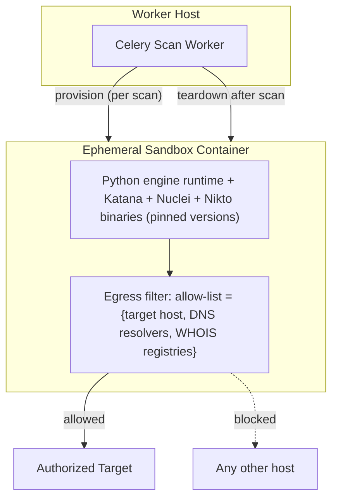
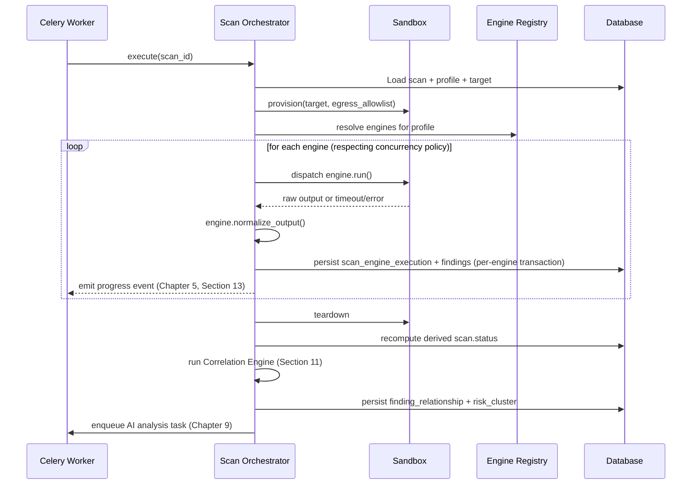
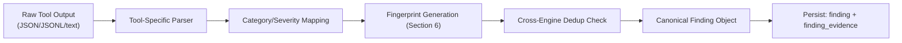
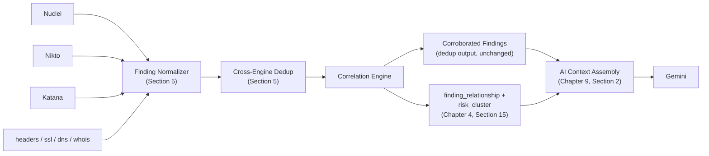

# Software Requirements Specification
## AI-Assisted Vulnerability Assessment Platform

**Chapter 8 — Scanner Engine**
**Version:** 2.0 (Revised Draft) | **Status:** For Review
**Prerequisite:** Chapters 1–7

> Deepens Chapter 2, Section 5, Chapter 3, Sections 3 & 13, and Chapter 4, Section 5 into the concrete internal design of the scanning subsystem — the part of the platform that touches authorized third-party targets and therefore carries the highest safety/legal stakes in the codebase.

---

## Table of Contents

1. Engine Registry & Plugin Contract
2. Sandbox Container Design
3. Engine Wrapper Implementations
4. Scan Orchestrator Internal Flow
5. Output Normalization Pipeline
6. Fingerprint Generation Algorithm
7. Concurrency & Timeout Management
8. Engine & Template Versioning
9. Failure Handling & Partial Completion
10. Extensibility: Adding a New Engine
11. Correlation Engine (Security Assessment Graph)

---

## 1. Engine Registry & Plugin Contract

Every engine implements the shared Python interface (`scanning/engineBase.py`):

```python
class ScanEngine(Protocol):
    id: str                      # matches scan_engine.code (Chapter 4, Section 3.5)
    category: str                # crawler | vulnerability | webserver | configuration | dns | registration

    async def run(self, target: NormalizedTarget, context: ScanContext) -> RawEngineOutput: ...
    def normalize_output(self, raw: RawEngineOutput) -> list[NormalizedFinding]: ...
    def risk_weight(self, finding: NormalizedFinding) -> float: ...
```

The `engineRegistry.py` module maps `scan_engine.code` → concrete implementation class at startup. The **Scan Orchestrator never imports a specific engine module directly** — it resolves engines purely through the registry using the profile's configured engine list (Chapter 4, Section 5.1), which is what makes the "add an engine without touching the orchestrator" claim from Chapter 4, Section 14 structurally true.

---

## 2. Sandbox Container Design



- **One sandbox per scan**, not per engine — engines within a scan run sequentially or bounded-concurrently (Section 7) inside the same ephemeral container, then the container is destroyed. This bounds resource usage per scan and guarantees no state (cached DNS, cookies, temp files) leaks between unrelated scans of different targets.
- **Provisioning goes through the `SandboxRunner` abstraction** (Chapter 6, Section 8), not direct Docker calls from worker code — `WORKER -->|"provision"| Sandbox` in the diagram above is `SandboxRunner.provision(target)`, implemented by `DockerSandboxRunner` for the MVP. The worker process never holds Docker socket access itself; only the `SandboxRunner` implementation does, and it does nothing except provision/teardown this one kind of ephemeral container.
- **No persistent volume.** The sandbox filesystem is ephemeral (`tmpfs` or container-layer only); any output that must survive is streamed to the worker process over a bounded IPC channel (stdout capture per subprocess, per Chapter 3, Section 13) — nothing is read back from the sandbox filesystem after teardown.
- **No database or cache credentials, ever.** The sandbox holds no PostgreSQL connection string, no Redis connection string, and no network path to either (Chapter 2, Section 13's stated invariant) — it is compute-only, full stop. All normalization and persistence happens in the worker process after output is streamed out, never inside the sandbox.
- **Resource limits:** CPU and memory limits (cgroup-enforced) and a hard wall-clock scan-level timeout independent of individual engine timeouts (Section 7), so a sandbox can never run indefinitely even if every internal timeout is somehow bypassed.
- **Egress allow-list is computed per scan**, not statically configured — resolved from the specific `target.normalized_url`'s hostname plus the fixed set of DNS/WHOIS infrastructure endpoints, and enforced at the container network layer (not merely trusted to application code), giving a second, independent layer of SSRF/scope-creep defense beyond the input-validation layer in Chapter 2/3. Default-deny is the starting posture — nothing is reachable unless explicitly allow-listed for that specific scan.

---

## 3. Engine Wrapper Implementations

### 3.1 Katana (Crawler)
- Invoked as a subprocess with explicit, discrete CLI arguments (no shell string building — Chapter 3, Section 13): target URL, crawl-depth limit, output format (`-jsonl`), and a request-rate flag to keep crawling polite/non-intrusive (Chapter 1, R-03).
- Output (JSONL, one discovered URL/asset per line) is streamed and parsed incrementally rather than buffered entirely in memory, since a large site's crawl output can be substantial.
- Discovered assets become input context for the vulnerability engines (Section 3.2/3.3) — e.g., forms discovered by Katana can be flagged for deeper header/config inspection.

### 3.2 Nuclei (Vulnerability Scanner)
- Invoked against the target (and, where relevant, specific paths surfaced by Katana) using a **pinned, version-controlled template set** (Chapter 3, Section 13) — templates are curated for non-intrusive detection (informational/CVE/misconfiguration templates), explicitly excluding template categories that perform exploitation or intrusive fuzzing, consistent with Chapter 1's Out-of-Scope boundary (no active exploitation).
- JSON output per match includes template ID, matched-at location, and severity metadata already provided by the Nuclei template — mapped into `finding_category`/`severity_level` via a maintained lookup table (`nuclei_template_id → (category_code, default_severity)`), reviewed whenever the template set is updated.

### 3.3 Nikto (Web Server Scanner)
- Invoked with output format set to a structured mode (e.g., `-Format json` where supported by the installed Nikto version) to avoid fragile text-scraping of human-readable output.
- Nikto findings are tagged `source_engine_code = "nikto"` (Chapter 4, Section 6.1) and cross-referenced against Nuclei findings on the same host during normalization (Section 5) to detect and mark likely duplicates (e.g., both tools flagging the same outdated server banner) rather than presenting them as two unrelated findings.

### 3.4 Python-Native Engines
| Engine | Library | Behavior |
|---|---|---|
| `headers-analyzer` | `httpx` | Issues a single authorized `GET`/`HEAD` request, inspects response headers against a maintained checklist (CSP, HSTS, X-Frame-Options, X-Content-Type-Options, Referrer-Policy, Permissions-Policy). |
| `ssl-inspector` | `sslyze` | Certificate chain validity/expiry, supported protocol versions, cipher suite strength. |
| `dns-lookup` | `dnspython` | A/AAAA/MX/TXT/NS/CNAME record resolution. |
| `whois-lookup` | `python-whois` (or sanitized shell-out) | Domain registration metadata; gracefully handles registrars with WHOIS privacy/redaction enabled rather than treating a redacted response as an error. |

---

## 4. Scan Orchestrator Internal Flow



Each engine's results are persisted **as soon as that engine completes**, not batched until the whole scan finishes — this is what allows the `finding.created` real-time events (Chapter 5, Section 13) and progressive UI population (Chapter 7, Section 5) to work, and what allows a scan to be usefully `PARTIALLY_COMPLETE` rather than all-or-nothing.

---

## 5. Output Normalization Pipeline



- Each engine's parser is isolated in its own module (Chapter 3, Section 13) and produces an intermediate, tool-specific representation before mapping to the canonical `Finding` shape — this isolation means a Nuclei output-format change (e.g., a new Nuclei major version altering its JSON schema) only requires updating `NucleiEngine.normalize_output()`, with zero impact on Katana/Nikto/native engine code.
- **Cross-engine dedup** compares fingerprints (Section 6) generated for near-simultaneous findings on the same target/asset from different engines (typically Nuclei vs. Nikto) — a near-duplicate is not silently discarded but linked via a **`finding_relationship` row with `relationship_type = DUPLICATE`** (Chapter 4, Section 15.3), preserving both tools' evidence while avoiding a doubled severity count on the dashboard. This is the same table the Correlation Engine (Section 11) writes to — `finding_relationship` is the one and only place an inter-finding relationship is ever recorded, whether it comes from dedup or from correlation. The dedup step's writes reference the reserved `CROSS_ENGINE_DEDUP` system rule (Chapter 4, Section 15.2), keeping every edge in the graph traceable to a named mechanism.
- Deduplication answers "is this the same finding reported twice." A separate, later question — "are these *different* findings meaningfully related" — is deliberately not answered here. That's the Correlation Engine's job (Section 11), which runs once per scan after every engine's findings are persisted, not per-engine during normalization.

---

## 6. Fingerprint Generation Algorithm

Implements Chapter 4, Section 6.1's `fingerprint` column — the mechanism that makes cross-scan finding-lifecycle tracking possible.

```
fingerprint = SHA256(
    normalize(target.hostname) + "|" +
    finding_category.code + "|" +
    normalize(identifier)     # e.g., CVE ID, header name, template ID, affected_path (path-normalized)
)
```

- **`normalize(identifier)`** strips volatile elements (timestamps, session-specific query parameters, case differences) so the same underlying issue produces the same fingerprint across scans even if superficial details of the raw match differ.
- **Category-specific identifier rules** are maintained per finding category (e.g., for `KNOWN_CVE`, the identifier is the CVE ID; for `MISSING_SECURITY_HEADER`, it's the specific header name; for `OUTDATED_TLS`, it's the specific protocol version flagged) — this mapping is a reviewed, version-controlled table (`fingerprint_identifier_rules.py`), not ad-hoc per-engine logic, so fingerprint stability is a single auditable concern.
- **Fingerprint stability is a tested invariant** (Chapter 3, Section 15; Chapter 13) — a dedicated test suite re-runs normalization against recorded historical raw outputs to catch any change that would silently break lifecycle tracking (e.g., a Nuclei template rename that changes an identifier without a corresponding fingerprint-rule update).

---

## 7. Concurrency & Timeout Management

| Level | Timeout | Concurrency Policy |
|---|---|---|
| Individual engine invocation | Per-engine configurable ceiling (e.g., Katana 3 min, Nuclei 5 min, Nikto 5 min, native engines 30–60s) | — |
| Whole-scan wall clock | Hard ceiling per profile (Chapter 2, Section 5.3 targets) — scan force-terminated and marked `PARTIALLY_COMPLETE` if exceeded | — |
| Within a scan | Engines with no data dependency (e.g., DNS, WHOIS, headers, SSL) may run concurrently; Nuclei/Nikto may optionally run after Katana completes so they can leverage crawler-discovered paths, at the cost of some added sequential time — this trade-off is a configurable orchestrator policy, not hardcoded | Bounded worker-pool concurrency per sandbox to respect the "non-intrusive scan" principle (Chapter 1, R-03) — engines are not fired in an unbounded burst against the target |

A timed-out engine is recorded as `scan_engine_execution.status = TIMED_OUT` (Chapter 4, Section 5.3) — indistinguishable in downstream handling from any other engine failure, keeping the partial-completion logic uniform.

---

## 8. Engine & Template Versioning

- Katana/Nuclei/Nikto binary versions are pinned in the sandbox Docker image (Chapter 3/12); a version bump is a reviewed PR against the Dockerfile, run through the same CI gate as application code.
- **Nuclei templates** are the fastest-moving dependency in this stack (community templates update frequently). The Platform maintains its own curated, version-controlled template subset (Chapter 3, Section 13) rather than pulling the full upstream template repo live at scan time — template-set updates go through: (1) diff review against the previous pinned set, (2) a test run against the controlled local test targets (Chapter 13), (3) merge and version-tag before any production scan uses the new set.
- Every `scan_engine_execution.tool_version_snapshot` (Chapter 4) captures the exact tool version *and*, for Nuclei, the template-set version tag — enabling a definitive answer to "would this scan have found X" for any point in the platform's history.

---

## 9. Failure Handling & Partial Completion

Recapping and grounding Chapter 2/3/4's partial-completion design at the implementation level:

- Each engine invocation is independently wrapped; an exception, non-zero exit code, or timeout in one engine is caught at the orchestrator level and recorded — it never propagates to abort sibling engine executions already scheduled.
- **Sandbox provisioning failure** (e.g., resource exhaustion, image pull failure) is retried up to a small bounded count before the entire scan is marked failed with a clear, user-facing message distinct from a "target unreachable" outcome — these are different failure classes and the UI (Chapter 7, Section 8) must be able to tell the user which one occurred.
- **Target unreachable / DNS resolution failure** at the start of a scan short-circuits remaining network-dependent engines immediately (no point running Nuclei against a host that doesn't resolve) but still records the DNS/WHOIS engines' own independent results, since a domain can have valid WHOIS/DNS data while its web server is temporarily down.

---

## 10. Extensibility: Adding a New Engine

Concrete checklist validating Chapter 4, Section 14's "new engine = no schema migration" claim end-to-end:

1. Insert a new row into `scan_engine` (Chapter 4, Section 3.5) with a unique `code`.
2. Implement the `ScanEngine` protocol (Section 1) in a new module under `scanning/engines/<new-engine>/`.
3. Register the implementation in `engineRegistry.py`.
4. Add category-specific fingerprint identifier rules if the engine introduces a new `finding_category` (also a data insert, per Chapter 4, Section 3.2).
5. Add the engine to one or more `scan_profile_engine` mappings.
6. Add a unit test suite for `normalize_output()` against recorded sample raw output (Chapter 13).
7. Pin the engine's binary/library version in the sandbox image (Chapter 12) if it's an external tool.

No step here touches the Scan Orchestrator, the API layer, or the frontend — the new engine's findings flow through the existing normalization → persistence → AI-explanation → reporting pipeline automatically.

---

## 10. Contextual Priority Baseline

SentinelGPT must not present a hand-chosen weighted score as universal security truth. For the MVP, a **transparent rule-based baseline** may combine normalized CVSS, exploitation signal, external exposure, asset criticality, and evidence confidence. The exact weights are configuration and must be versioned with experiments.

The research compares at minimum:

1. CVSS/severity-only ranking.
2. Deterministic contextual baseline.
3. SentinelGPT-assisted prioritization.

Every priority decision stores its component inputs, policy/rule version, missing-data indicators, and rationale. AI may explain or propose a priority but cannot overwrite the deterministic canonical severity. Expert agreement is the primary external reference for evaluating prioritization quality.

## 11. Correlation Engine (Security Assessment Graph)

A single scan can produce a dozen isolated-looking findings that are, in reality, one connected story: an exposed admin panel, a missing authentication control, and a fingerprinted outdated web server on the same host are far more dangerous *together* than any one of them read in isolation. The Correlation Engine's job is to surface that story — deterministically, from evidence the platform has already, authorizedly collected — without ever taking a new action against the target.

### 11.1 Where It Sits in the Pipeline



The Correlation Engine runs **once per scan, after all engines have completed or the scan has been finalized as `PARTIALLY_COMPLETE`** — never per-engine, since its entire value is in finding relationships *across* engines and *across* categories. It reads the scan's already-persisted, canonical `finding` rows; it never re-contacts the target, never re-runs an engine, and never issues a network request of any kind. This is what keeps it on the passive side of Chapter 1's Out-of-Scope line (no active exploitation) even though its output looks, visually, like an attack path.

### 11.2 Deterministic Rule Evaluation, Not AI Inference

This is the load-bearing design decision: **the Correlation Engine is a rules engine, not a model.** It evaluates the scan's findings against the version-controlled `correlation_rule` table (Chapter 4, Section 15.2) — each rule is a simple, explicit condition (e.g., "a finding of category `EXPOSED_ADMIN_PANEL` and a finding of category `MISSING_AUTH_CONTROL` on the same `affected_asset` within the same scan") evaluated in plain Python, with no LLM call anywhere in this step. A relationship either matches a rule or it doesn't; there is no "the model thought these seemed related." This mirrors the same governance already established for Nuclei templates (Section 3.2) and fingerprint identifier rules (Section 6): a reviewed, version-controlled table, not inferred at runtime.

The reason this matters as much as it does: if correlation were AI-driven instead, the platform would be reintroducing, one layer up, exactly the hallucination risk (Chapter 1, R-02) that Chapter 9's entire evidence-grounding architecture exists to eliminate at the explanation layer. Keeping correlation deterministic means Chapter 9's AI layer can safely treat a `risk_cluster` the same way it treats a `finding` — as verified, structural evidence to explain, never as a claim to originate.

### 11.3 Rule Evaluation Algorithm

```python
def evaluate_correlations(scan_id: UUID, findings: list[Finding]) -> list[FindingRelationship]:
    relationships = []
    for rule in active_correlation_rules():  # Chapter 4, Section 15.2
        matches_a = [f for f in findings if f.category_id == rule.condition_category_a_id]
        matches_b = (
            [f for f in findings if f.category_id == rule.condition_category_b_id]
            if rule.condition_category_b_id else matches_a
        )
        for a, b in candidate_pairs(matches_a, matches_b):
            if a.id == b.id:
                continue
            if rule.requires_same_asset and a.affected_asset != b.affected_asset:
                continue
            relationships.append(FindingRelationship(
                scan_id=scan_id, finding_id_a=a.id, finding_id_b=b.id,
                relationship_type_id=rule.relationship_type_id,
                triggered_by_rule_id=rule.id,
            ))
    return relationships
```

Relationships found this way are grouped into `risk_cluster` rows (Chapter 4, Section 15.4) — connected components of the relationship graph become one cluster, with `cluster_severity_level_id` set to at least the rule's configured `cluster_severity_floor_id`, reflecting that a corroborated combination is treated as at least as urgent as its most severe individual finding, and often more so.

### 11.4 Non-Goals (Explicit Scope Boundary)

To keep this component from drifting toward the territory Chapter 1 deliberately excluded:

- **Not an attack-path executor.** The Correlation Engine never attempts to verify that a relationship is actually exploitable — it reports "these findings co-occur in a way our ruleset flags as significant," never "this attack would succeed."
- **Not a network-active component.** It has no engine wrapper, no sandbox access, and appears nowhere in Section 2's egress allow-list — architecturally, it cannot make an outbound request even if its code tried to.
- **Not a source of new findings.** It only relates `finding` rows that already exist from an engine's normalized output (Section 5); it cannot create a `finding` of its own.

### 11.5 Testing & Extensibility

Following the same golden-file discipline as engine normalization (Chapter 13, Section 4): each `correlation_rule` ships with recorded test fixtures (a small set of findings that should, and should not, trigger it), so a rule change is reviewable the same way a Nuclei template update is. Adding a new correlation rule is a `correlation_rule` data insert (Chapter 4, Section 15.8) referencing existing `finding_category` rows — no code change, no migration, consistent with every other extensibility path this SRS establishes.

---

*End of Chapter 8. Chapter 9 (AI Analysis) covers what happens to the `Finding` objects this chapter produces once they leave the scanning subsystem.*
